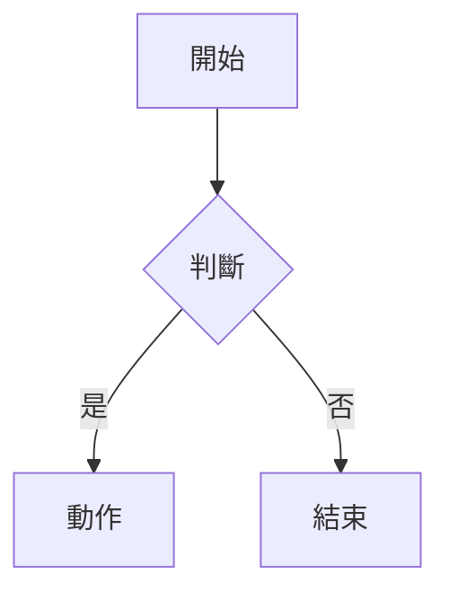

# FMD_AI_Screener 文件產生器

## 快速開始

```bash
# 每次更新文件後，重新產生 Word
python3 gen_doc.py
```

## 流程說明

`gen_doc.py` 會自動：

1. 讀取 `設計文件書_FMD_AI_Screener.md`
2. 將所有 ` ```mermaid ` 區塊 render 成 PNG，存到 `imgs/diagram_*.png`
3. 將 markdown 中的 mermaid 區塊換成 `` 語法
4. pandoc 轉出 Word：`設計文件書_FMD_AI_Screener.docx`

## 加入新圖表

在 markdown 中用標準 mermaid 語法：

````

````

執行 `python3 gen_doc.py` 後，圖表會自動 render 並取代。

## 圖片手動調整

如果某張圖需要特殊參數（例如 ER Diagram 需要更大寬度），直接修改 `gen_doc.py` 中的邏輯。ER 圖表的 render 參數在第 42–45 行：

```python
if is_er:
    cmd = [MMDC, "-i", ..., "-w", "20000", "-s", "2"]
else:
    cmd = [MMDC, "-i", ..., "-w", "2000"]
```

## 工具需求

- `mmdc`（mermaid-cli）：`npm install -g @mermaid-js/mermaid-cli`
- `pandoc`：轉 Word 用
- `python3`：執行腳本

## 資料夾結構

```
Desktop/test/
├── 設計文件書_FMD_AI_Screener.md    # 主要文件（用 mermaid 語法）
├── gen_doc.py                        # 文件產生器（本腳本）
├── imgs/                             # 自動產生的圖片
│   ├── diagram_1.png   # §2.2 系統範圍
│   ├── diagram_2.png   # §2.3 三層式架構
│   ├── diagram_3.png   # §3.1.2 部署架構
│   ├── diagram_4.png   # §3.2.1 類別圖
│   ├── diagram_5.png   # §3.4.1 使用案例圖
│   ├── diagram_6.png   # §3.4.2 循序圖
│   ├── diagram_7.png   # §3.4.3 活動圖
│   └── diagram_8a.png  # 附錄D ER 圖
├── 設計文件書_FMD_AI_Screener.docx       # 輸出 Word
└── 設計文件書_FMD_AI_Screener_with_imgs.md # 含圖片的 markdown（中間產物）
```

## 常見問題

**Q: mermaid 語法錯誤導致 render 失敗？**
A: 檢查 `imgs/diagram_*.mmd` 看哪個 block 失敗了，单独用 `mmdc -i diagram_N.mmd -o test.png` debug。

**Q: ER 圖字太小？**
A: ER 圖已用 `-w 20000 -s 2` 渲染，夠大。如果仍太小，調整 `gen_doc.py` 中的參數。

**Q: 只想重新 render 某張圖？**
A: 砍掉對應的 `imgs/diagram_N.png`，再執行 `python3 gen_doc.py`，只會重 render 消失的圖。
