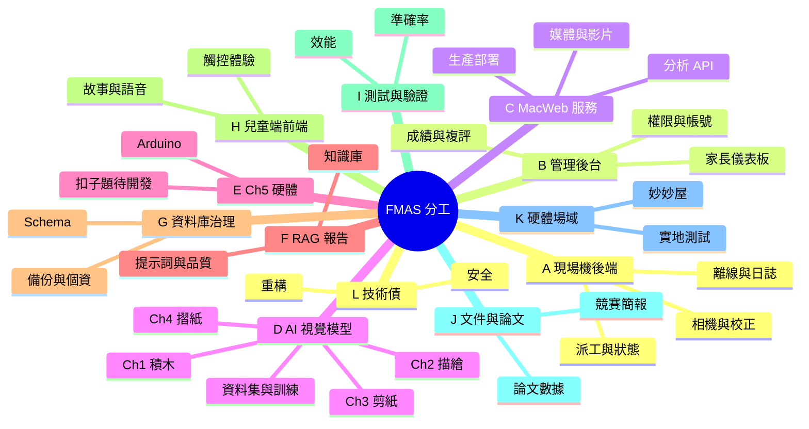

# FMAS 團隊分工項目清單

> 用途：把專案所有可認領的工作拆成獨立項目，供組員自行挑選。
> 團隊：洪偉城、林政維、呂昊宸、林宛瑩（4 人）
> 基準：本清單依 repo 現況（`374fba0`）盤點，非空想的 wish list —— 每一項都標了實際檔案位置。

---

## 一、怎麼選

1. **先看「領域總覽」**，決定你想待在哪一兩個領域（跨太多領域會很難交接）。
2. **再從項目清單挑**，把你要的編號填進最後的〈認領表〉。
3. **先搶「🔴 必做」的項目**，再看 🟡 建議、🟢 加分。
4. 標「👥 共管」的項目不要一個人扛，至少兩人一起。
5. 一個人建議認領 **8～12 個項目 / 約 60～80 小時**，不要一次把整個領域包走。

### 圖例

| 標記 | 意義 |
| :--- | :--- |
| 🔴 | 必做（沒有做完專題就不完整） |
| 🟡 | 建議（做了明顯加分，不做不會壞） |
| 🟢 | 加分（有餘力再說） |
| 👥 | 需要兩人以上共管 |
| ⭐ | 難度（⭐ 容易 / ⭐⭐ 中等 / ⭐⭐⭐ 困難） |
| ⏱ | 預估工時（小時） |

---

## 二、領域總覽

---

## 三、項目清單

### A. 現場機後端（`PDMS2_web/run.py`）

| # | 項目 | 做什麼 | 主要檔案 | 優先 | 難度 | ⏱ |
| :--- | :--- | :--- | :--- | :--- | :--- | :--- |
| A1 | 相機服務維護 | 雙鏡頭開啟、裝置掃描、ROI 子行程選取，處理不同筆電/USB 相機 index 飄移 | `run.py:525-633, 1762-1938` | 🔴 | ⭐⭐ | 10 |
| A2 | 派工狀態機落盤 | `processing_tasks` 目前只在記憶體，重啟就全失。改成落盤或入庫 | `run.py:1408-1662` | 🟡 | ⭐⭐ | 8 |
| A3 | 設定頁與校正同步 | 相機 index / ROI / px2cm / 標準面積的設定 UI 與 `machine_configs` 同步 | `setting.html`、`run.py:270-372` | 🔴 | ⭐⭐ | 12 |
| A4 | 離線快取與斷線重送 | README 宣稱「偏鄉網路中斷可離線、恢復後自動同步」，**目前程式沒有這段**，要補或改規格 | `run.py`、`js/script.js` | 🔴👥 | ⭐⭐⭐ | 20 |
| A5 | 日誌與健康檢查 | `console.txt` 輪替、`/logs/tail`、`/db/ping`，現場出事時要能快速定位 | `run.py:841-891, 1116-1130` | 🟡 | ⭐ | 6 |
| A6 | DEMO_MODE 測試模式 | 不接相機時讀 `testpic/` 跑完整流程，展示與 debug 都需要 | `run.py:2001-2210`、`testpic/` | 🟡 | ⭐ | 5 |

### B. 管理後台（`PDMS2_web/admin.py` + 管理頁前端）

| # | 項目 | 做什麼 | 主要檔案 | 優先 | 難度 | ⏱ |
| :--- | :--- | :--- | :--- | :--- | :--- | :--- |
| B1 | 成績總表與即時刷新 | `/scores` 查詢、篩選、SSE 推播刷新 | `admin.py:857-991`、`js/admin.js` | 🔴 | ⭐⭐ | 10 |
| B2 | 人工複評流程 | 職能治療師覆寫 AI 分數，寫入 `manual_score` 並在總表疊加顯示 | `admin.py:338-622, 1130-1168` | 🔴 | ⭐⭐ | 10 |
| B3 | 原圖／結果圖對照頁 | `/view-compare` 並排比對，Ch5 另顯示豆子時間軸 | `admin.py:623-769` | 🟡 | ⭐⭐ | 8 |
| B4 | 帳號與權限管理 | Level 1/2/3 三級權限、`superadmin.html` 帳號 CRUD | `admin.py:770-846, 1253-1335` | 🔴 | ⭐⭐ | 10 |
| B5 | 家長儀表板 | 五大能力雷達圖、歷程、AI 建議呈現 | `html/parent_dashboard.html`（933 行） | 🔴 | ⭐⭐ | 14 |
| B6 | 管理端手機版 RWD | 總覽表改卡片、評分頁縮放，已開頭但未完成 | `css/`、`html/admin.html` | 🟡 | ⭐ | 8 |
| B7 | 報表匯出 | 家長版（短版指標）與專業版（長版歷程）報表產出 | 新增 | 🟡 | ⭐⭐ | 12 |

### C. MacWeb 分析與媒體服務（`MacWeb/web.py`）

| # | 項目 | 做什麼 | 主要檔案 | 優先 | 難度 | ⏱ |
| :--- | :--- | :--- | :--- | :--- | :--- | :--- |
| C1 | 分析 API 改非同步 | `/api/analysis/submit` 目前是同步且現場機 timeout 180s，改成回 job id + 狀態查詢 | `MacWeb/web.py:691-760` | 🟡 | ⭐⭐⭐ | 16 |
| C2 | 媒體簽名與存取治理 | HMAC 簽名網址、UID 不可列舉、過期機制 | `MacWeb/web.py:557-645` | 🟡 | ⭐⭐ | 8 |
| C3 | 影片上傳流程 | `faststart` 轉檔、扣子題寫入待人工評分（`score = NULL`） | `MacWeb/web.py:762-860` | 🟡 | ⭐⭐ | 8 |
| C4 | 生產環境部署 | **目前 `debug=True` 對 0.0.0.0 開放**，要關 debug、掛 WSGI、設開機自啟 | `MacWeb/web.py:864` | 🔴 | ⭐⭐ | 8 |
| C5 | Tailscale 連線維運 | 現場機↔Mac 的連線設定、斷線偵測與文件化 | 維運 | 🔴 | ⭐⭐ | 8 |

### D. AI 視覺模型

| # | 項目 | 做什麼 | 主要檔案 | 優先 | 難度 | ⏱ |
| :--- | :--- | :--- | :--- | :--- | :--- | :--- |
| D1 | Ch1 積木（4 題） | 串珠／金字塔／階梯／砌牆，YOLO + SAM + 分層骨架判斷 | `ch1-t1` ~ `ch1-t4/` | 🔴 | ⭐⭐⭐ | 25 |
| D2 | Ch1 被停用判斷的復原 | 程式裡三處 `=== 暫時停用 offset(對齊) 判斷 ===`、`暫時停用俯視圖 ROI 裁切`，要確認是暫時還是永久 | `ch1-t2/main.py:110,154`、`ch1-t3/main.py:111,157`、`ch1-t4/main.py:97,138` | 🔴 | ⭐⭐ | 10 |
| D3 | Ch2 描繪（6 題） | 畫圓／方／十字／線／著色／連點，A4 校正 + 分類模型 + 幾何評分 | `ch2-t1` ~ `ch2-t6/` | 🔴 | ⭐⭐⭐ | 30 |
| D4 | Ch3 剪紙（4 題） | 剪圓／方／紙／線，YOLO 遮罩 + ArUco 尺度校正 | `ch3-t1` ~ `ch3-t4/` | 🔴 | ⭐⭐⭐ | 25 |
| D5 | Ch4 摺紙（2 題） | 折一折／折兩折，彩色邊緣 + 最大四邊形 | `ch4-t1`、`ch4-t2/` | 🔴 | ⭐⭐ | 15 |
| D6 | 資料集擴增與再訓練 | Gemini 生成擴增 + Roboflow 標註 + YOLO 訓練 | `*_yolo/`、`runs/segment/` | 🔴👥 | ⭐⭐⭐ | 30 |
| D7 | 模型權重集中管理 | `sam_vit_b_01ec64.pth` 在 Ch1 四個目錄各存一份，集中到 `models/` 並以設定指向 | `ch1-t*/` | 🟡 | ⭐ | 5 |
| D8 | 尺度校正鏈驗證 | ROI → px2cm → standard_area 三層校正在不同場域的穩定度 | `px2cm.py`、`get_cm1.py` | 🔴 | ⭐⭐ | 12 |

### E. Ch5 硬體與即時量測

| # | 項目 | 做什麼 | 主要檔案 | 優先 | 難度 | ⏱ |
| :--- | :--- | :--- | :--- | :--- | :--- | :--- |
| E1 | Arduino 韌體與感測 | 豆子計數感測器、倒數計時、`[GO!]` 握手訊號、9600 baud 串列協定 | Arduino 端 + `ch5-t1/main.py:57-160` | 🔴 | ⭐⭐⭐ | 20 |
| E2 | Ch5 相機與錄影復原 | 程式內 `=== 暫時停用相機與錄影（僅跑 Arduino 流程）===`，要決定是否復原 | `ch5-t1/main.py:169` | 🟡 | ⭐⭐ | 10 |
| E3 | Ch5 紀錄檔治理 | `kid/ch5-t1_records.json` 是全體共用的單一大 JSON，有併發與膨脹風險 | `run.py:686-721` | 🟡 | ⭐⭐ | 6 |
| E4 | Ch5-t2／t3 扣子題 | `TASK_MAP` 已保留 `unbutton`／`button`，**但沒有分析腳本**，目前只能人工評分 | 新增 `ch5-t2/`、`ch5-t3/` | 🟢👥 | ⭐⭐⭐ | 30 |

### F. RAG 建議報告

| # | 項目 | 做什麼 | 主要檔案 | 優先 | 難度 | ⏱ |
| :--- | :--- | :--- | :--- | :--- | :--- | :--- |
| F1 | 知識庫擴充與切分 | PDMS-2 手冊、計分表、論文的切分策略與向量索引品質 | `RAG/`、`rag_advisor.py:_index_documents` | 🔴 | ⭐⭐ | 12 |
| F2 | 提示詞與報告品質 | 三層式報告（整合總結／發展重點／居家建議）的提示詞調校 | `utils/rag_advisor.py` | 🔴 | ⭐⭐ | 14 |
| F3 | 快取與成本控制 | `ai_advice_history` 快取判定、`force=1` 重生成、API 成本監控 | `rag_advisor.py`、`admin.py:143` | 🟡 | ⭐⭐ | 8 |
| F4 | RAG 測試與評估 | 用真實成績跑批次報告，人工評估建議是否合理 | `scripts/rag_tester.py`、`generate_real_reports.py` | 🟡 | ⭐⭐ | 10 |
| F5 | 依賴相容性維護 | `chromadb` / `langchain-chroma` 版本衝突已用 monkey patch 繞過，要追上游修正 | `rag_advisor.py:11-17` | 🟢 | ⭐⭐ | 5 |

### G. 資料庫與資料治理

| # | 項目 | 做什麼 | 主要檔案 | 優先 | 難度 | ⏱ |
| :--- | :--- | :--- | :--- | :--- | :--- | :--- |
| G1 | Schema 檢討 | 19 張任務明細表 + 共用表的設計檢討與索引 | `scripts/create_*_table.py` | 🟡 | ⭐⭐ | 10 |
| G2 | 備份與異地副本 | README 宣稱「每日自動備份與異地副本」，**需確認是否真的有設**，沒有就建 | 維運 | 🔴 | ⭐⭐ | 8 |
| G3 | 個資與保存政策 | 兒童個資分級存取、保存期限、去識別化 | 政策 + 文件 | 🔴 | ⭐⭐ | 10 |
| G4 | 資料維護腳本 | 建表、清資料、查帳號、上傳的維運腳本 | `scripts/` | 🟡 | ⭐ | 6 |

### H. 兒童端前端體驗

| # | 項目 | 做什麼 | 主要檔案 | 優先 | 難度 | ⏱ |
| :--- | :--- | :--- | :--- | :--- | :--- | :--- |
| H1 | 故事腳本與關卡流程 | `STORY` 常數驅動的 5 關 17 題闖關流程 | `js/script.js`（725 行） | 🔴 | ⭐⭐ | 14 |
| H2 | 語音導引與注音 | `SpeechSynthesis` + `voice_guide/` 預錄音檔 + 注音顯示 | `js/script.js`、`utils/bopomofo.js` | 🟡 | ⭐⭐ | 10 |
| H3 | 任務執行頁 | 單題操作、拍照、等待分析、結果回饋 | `js/task.js`（1285 行） | 🔴 | ⭐⭐ | 14 |
| H4 | 進度回饋與動畫 | 星星、貼紙、彩帶慶祝，維持兒童參與度 | `js/script.js:431-580` | 🟡 | ⭐ | 8 |
| H5 | 觸控可用性 | 14 吋觸控螢幕上的按鈕尺寸、誤觸、捲動 | `css/`、`js/custom-scrollbar.js` | 🔴 | ⭐⭐ | 10 |
| H6 | 口白稿與配音 | 幼兒版任務口白稿的錄製與替換 | `doc/幼兒版任務口白稿.md`、`voice_guide/` | 🟡 | ⭐ | 10 |

### I. 測試與驗證

| # | 項目 | 做什麼 | 主要檔案 | 優先 | 難度 | ⏱ |
| :--- | :--- | :--- | :--- | :--- | :--- | :--- |
| I1 | 各關準確率驗證 | 系統規格要求 **每關 ≥ 85%**，要逐關量測並留下數據 | `run_testpic.py`、`testpic/` | 🔴👥 | ⭐⭐⭐ | 25 |
| I2 | YOLO 遮罩 IoU 評估 | 已有腳本（未 commit），要跑完所有分割模型並整理成論文表格 | `scripts/eval_yolo_mask_iou.py` | 🔴 | ⭐⭐ | 12 |
| I3 | 與治療師交叉驗證 | AI 判讀 vs 職能治療師人工評估的一致性分析 | 場域 + 統計 | 🔴👥 | ⭐⭐⭐ | 20 |
| I4 | 效能驗證 | 介面回應 ≤ 2s、單次分析 ≤ 15s、總重 ≤ 10kg、架設 5 分鐘 | 量測 | 🔴 | ⭐⭐ | 10 |
| I5 | 端到端回歸測試 | 一鍵跑完 17 關的自動化驗證腳本，改模型後能快速回歸 | 新增 `scripts/` | 🟡 | ⭐⭐⭐ | 16 |
| I6 | 使用者測試 | 兒童實際操作的可用性觀察與紀錄 | 場域 | 🟡 | ⭐⭐ | 12 |

### J. 文件、論文與競賽

| # | 項目 | 做什麼 | 主要檔案 | 優先 | 難度 | ⏱ |
| :--- | :--- | :--- | :--- | :--- | :--- | :--- |
| J1 | 系統架構文件維護 | 架構有變就更新（本次已產出初版） | `doc/系統架構.md` | 🔴 | ⭐ | 6 |
| J2 | 論文撰寫 | 方法章節、實驗設計、數據表格（mAP 放表格、mean IoU 放內文） | 論文 | 🔴👥 | ⭐⭐⭐ | 40 |
| J3 | 需求規格書／測試計畫書更新 | 既有 PDF 與程式現況對齊 | `doc/*.pdf` | 🔴 | ⭐⭐ | 12 |
| J4 | README 與展示素材 | 33KB 的 README 維護、圖表、介紹影片 | `README.md`、`picture/` | 🟡 | ⭐ | 8 |
| J5 | 競賽簡報與海報 | 比賽用 A1 海報、簡報、Demo 腳本 | `picture/poster.png` | 🔴👥 | ⭐⭐ | 20 |
| J6 | 操作手冊 | 給衛生所／幼兒園第一線人員的圖文操作說明 | 新增 | 🟡 | ⭐⭐ | 12 |

### K. 硬體場域

| # | 項目 | 做什麼 | 主要檔案 | 優先 | 難度 | ⏱ |
| :--- | :--- | :--- | :--- | :--- | :--- | :--- |
| K1 | 妙妙屋結構與燈光 | 拱形可組裝隔板、光源燈條（影響辨識品質） | 硬體 | 🔴 | ⭐⭐ | 16 |
| K2 | 教具製作 | 與工設系協作的積木、測驗墊、卡片，需符合 PDMS-2 規格尺寸 | 硬體 | 🔴 | ⭐⭐ | 16 |
| K3 | 架設流程與收納 | 五分鐘架設、一袋帶走、總重 ≤ 10kg | 硬體 | 🟡 | ⭐ | 8 |
| K4 | 實地測試場次 | 聯繫場域、帶設備、現場施測與紀錄 | 場域 | 🔴👥 | ⭐⭐ | 20 |

### L. 技術債與安全

| # | 項目 | 做什麼 | 主要檔案 | 優先 | 難度 | ⏱ |
| :--- | :--- | :--- | :--- | :--- | :--- | :--- |
| L1 | 共用模組抽取 | DB helper 與 `TASK_MAP` 在 `run.py`／`admin.py`／`MacWeb` 各一份，新增題型要改三處 | 新增 `PDMS2_web/common/` | 🟡 | ⭐⭐ | 12 |
| L2 | 分數回傳協定統一 | 目前用 exit code 傳分數，崩潰的 `1` 與「得 1 分」無法區分。比照 Ch5 改用 stdout 結構化輸出 | 全部 `chX-tY/main.py` | 🟡👥 | ⭐⭐⭐ | 20 |
| L3 | 機密管理 | `.env` 含 DB 密碼與金鑰，確認已被 gitignore，改用 OS 金鑰管理 | `.env`、`.gitignore` | 🔴 | ⭐⭐ | 6 |
| L4 | CORS 與網路邊界 | `run.py` 的 `CORS(app)` 未限制來源，明確列出允許來源 | `run.py:838` | 🟡 | ⭐ | 4 |
| L5 | 相依套件整理 | 三份 requirements（現場機／venv39／yplab）的差異與統一 | `requirements*.txt` | 🟡 | ⭐⭐ | 8 |

---

## 四、統計

| 領域 | 項目數 | 總工時 | 其中必做 |
| :--- | ---: | ---: | ---: |
| A 現場機後端 | 6 | 61 | 3 |
| B 管理後台 | 7 | 72 | 4 |
| C MacWeb 服務 | 5 | 48 | 2 |
| D AI 視覺模型 | 8 | 152 | 7 |
| E Ch5 硬體 | 4 | 66 | 1 |
| F RAG 報告 | 5 | 49 | 2 |
| G 資料庫治理 | 4 | 34 | 2 |
| H 兒童端前端 | 6 | 66 | 3 |
| I 測試與驗證 | 6 | 95 | 4 |
| J 文件與論文 | 6 | 98 | 4 |
| K 硬體場域 | 4 | 60 | 3 |
| L 技術債與安全 | 5 | 50 | 1 |
| **合計** | **66** | **851** | **36** |

> 851 小時 ÷ 4 人 ≈ **每人 213 小時**。若只做 🔴 必做項目約 480 小時 ÷ 4 ≈ 每人 120 小時。
> 請以此為據評估要認領多少，不要超額認領。

---

## 五、參考角色包（想整包認領再看）

不強制，只是四種常見的搭配方式：

| 角色 | 核心領域 | 建議項目 |
| :--- | :--- | :--- |
| **AI／模型組** | D + I1 + I2 | D1 D2 D3 D6 D8 I1 I2 |
| **後端／系統組** | A + C + G + L | A1 A3 A4 C4 C5 G2 L1 L3 |
| **前端／體驗組** | B + H | B1 B2 B5 H1 H3 H5 H6 |
| **硬體／場域組** | E + K + J | E1 E2 K1 K2 K4 J5 |

RAG（F）與論文（J2）建議跨組共管，不要綁在單一角色。

---

## 六、認領表（請自己填）

| 項目編號 | 項目名稱 | 認領人 | 預計完成 | 狀態 |
| :--- | :--- | :--- | :--- | :--- |
|  |  |  |  | 未開始 |
|  |  |  |  | 未開始 |
|  |  |  |  | 未開始 |
|  |  |  |  | 未開始 |
|  |  |  |  | 未開始 |
|  |  |  |  | 未開始 |
|  |  |  |  | 未開始 |
|  |  |  |  | 未開始 |

---

## 七、選之前請注意

1. **D6（資料集與再訓練）會擋住 I1、I2、J2** —— 模型沒定版，準確率就量不了，論文數據也寫不了。認領 D6 的人請先排。
2. **A4（離線快取）是規格與現況的落差** —— README 已對外宣稱支援，程式裡沒有。要嘛補完，要嘛改規格說明，不能放著。
3. **C4（關閉 debug）現在就該做** —— `MacWeb/web.py` 以 `debug=True` 綁 `0.0.0.0`，只要有人連得到那台機器就能執行任意程式碼。工時 8 小時，但前 1 小時就能把風險壓掉。
4. **D2、E2 的「暫時停用」要先問清楚** —— 那幾行註解是誰、為什麼停的，決定是復原還是正式移除，不要各自猜。
5. **K4（實地測試）要提前排** —— 牽涉外部單位聯繫，前置時間最長。
