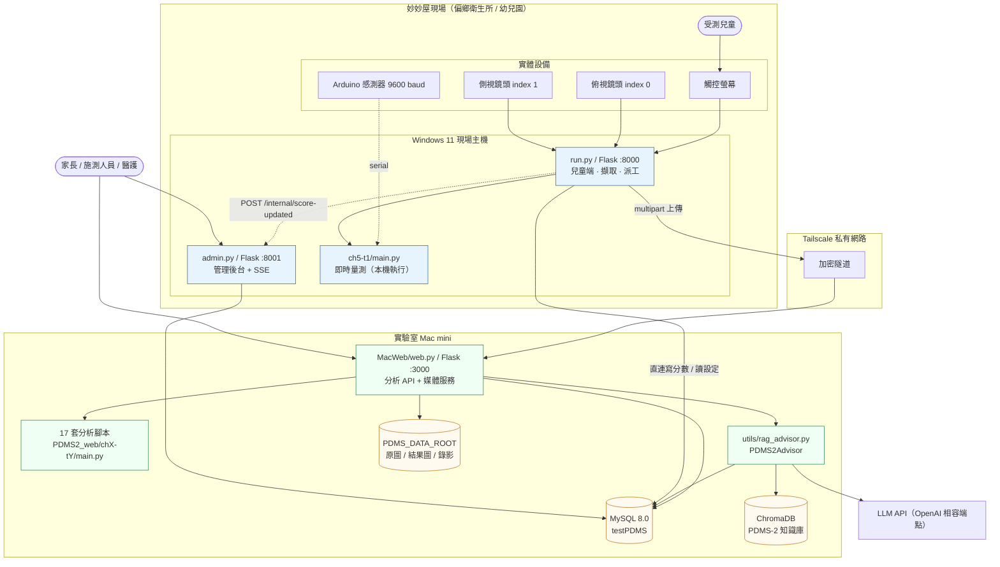
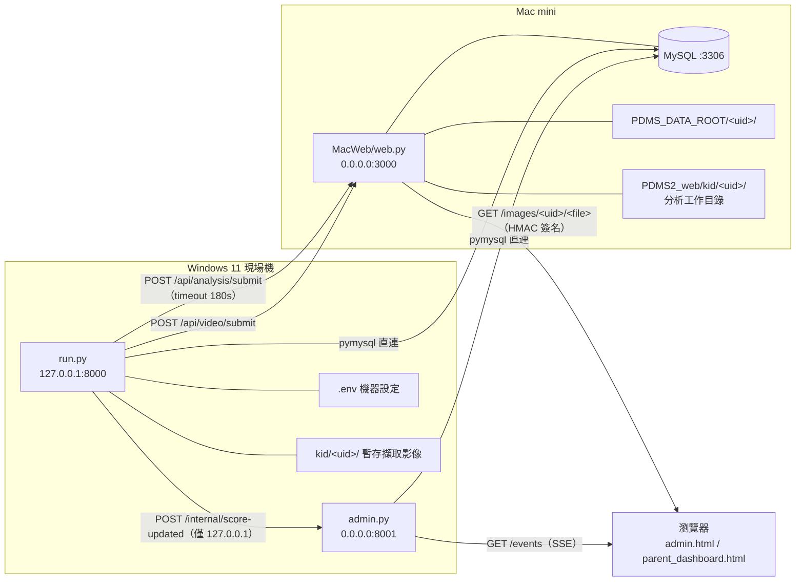
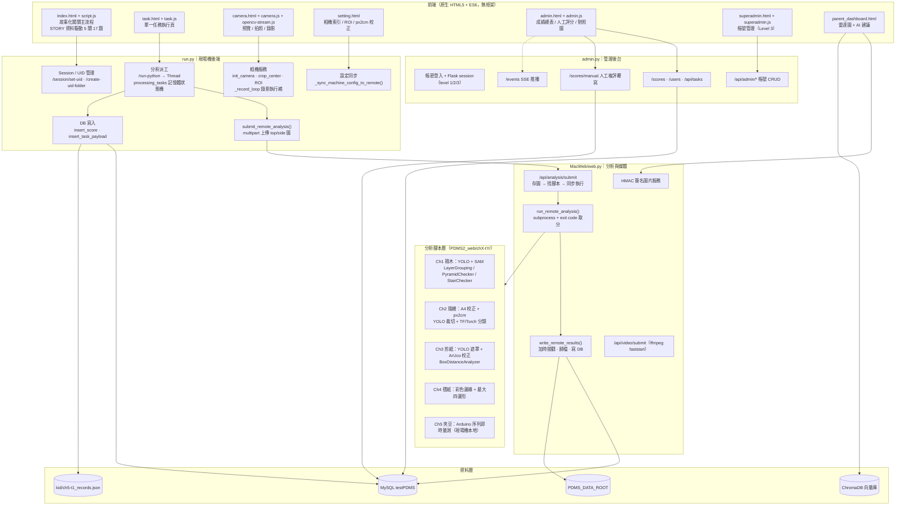
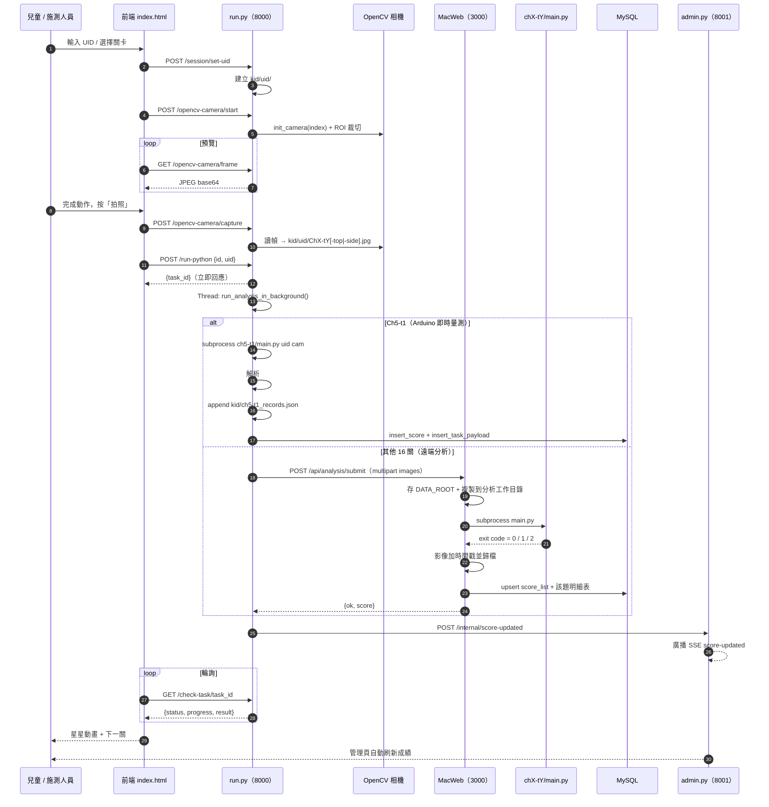
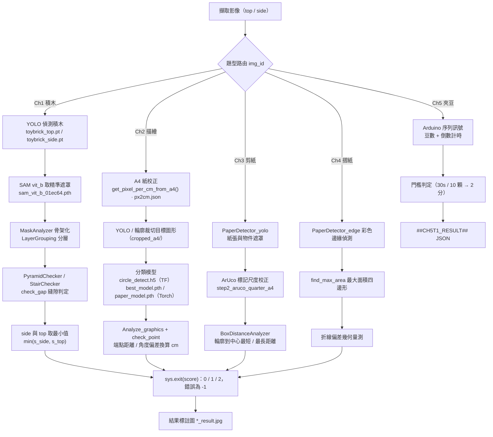
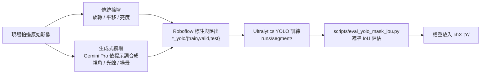
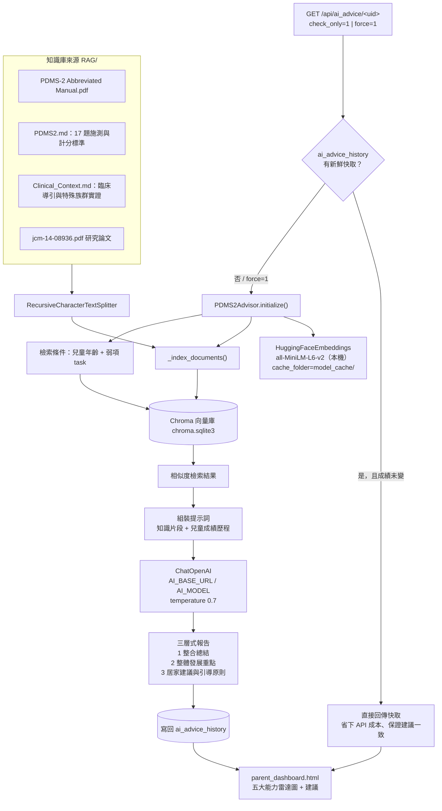
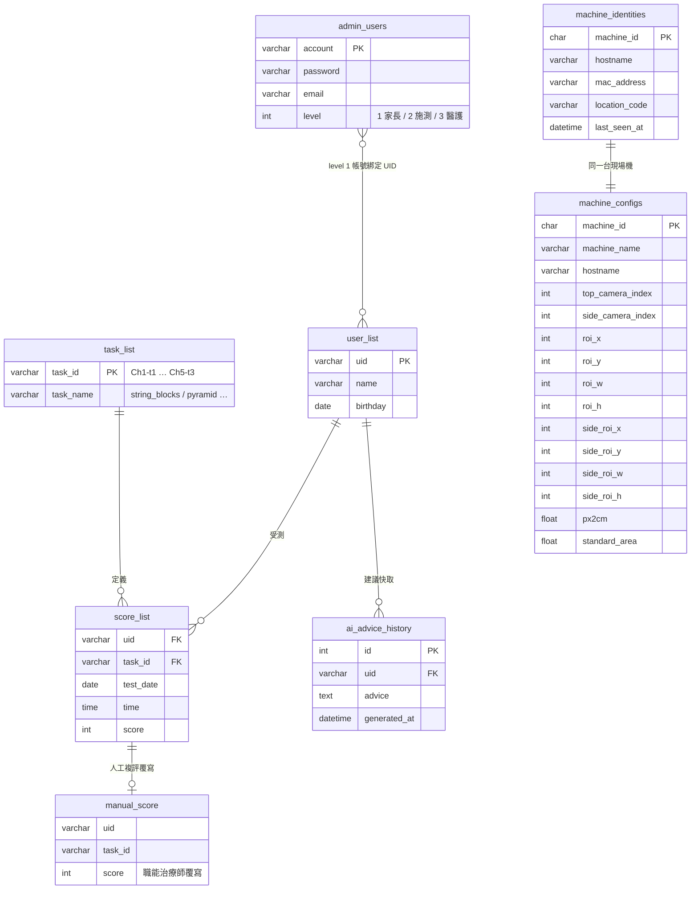
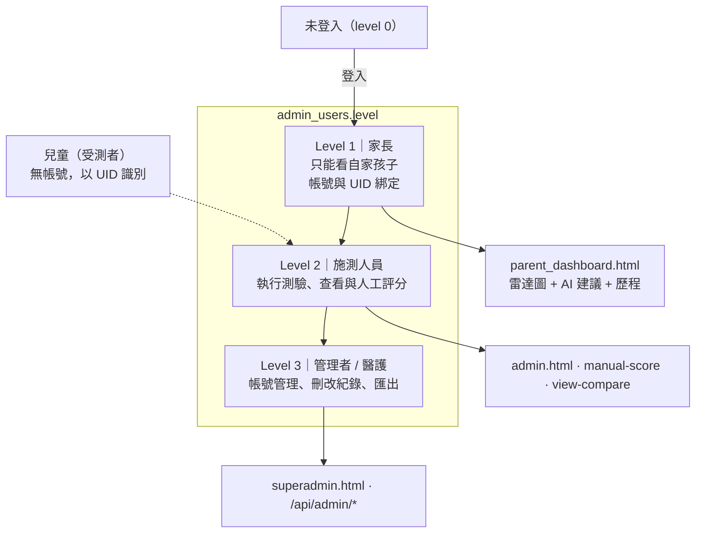

# FMAS 系統架構說明書

> 專案：運用 AI 技術判別精細動作之早期遲緩篩檢系統（FMD_AI_Screener / FMAS 妙妙屋）
> 本文以 repo 現況（`PDMS2_web/`、`MacWeb/`、`RAG/`）為準撰寫，描述實際程式碼中的模組、介面與資料流。

---

## 目錄

1. [架構總覽](#1-架構總覽)
2. [部署視圖](#2-部署視圖)
3. [元件視圖](#3-元件視圖)
4. [端到端流程（一次施測）](#4-端到端流程一次施測)
5. [AI 分析管線](#5-ai-分析管線)
6. [RAG 建議生成子系統](#6-rag-建議生成子系統)
7. [資料模型](#7-資料模型)
8. [API 介面清單](#8-api-介面清單)
9. [權限與身分模型](#9-權限與身分模型)
10. [設定與環境變數](#10-設定與環境變數)
11. [關鍵設計決策與取捨](#11-關鍵設計決策與取捨)
12. [已知風險與改善建議](#12-已知風險與改善建議)

---

## 1. 架構總覽

系統是一套 **邊緣擷取 / 中心運算（edge capture, central inference）** 的三段式架構：

| 層級 | 所在主機 | 角色 |
| :--- | :--- | :--- |
| **現場機（Edge）** | 妙妙屋內的 Windows 11 觸控主機 | 兒童遊戲前端、雙鏡頭影像擷取、Arduino 串列量測、把影像送出去 |
| **運算與資料中心（Core）** | 實驗室 Mac mini | 影像分析執行、MySQL 資料庫、媒體檔庫、RAG 建議生成 |
| **管理端（Back office）** | 任一瀏覽器（經 Tailscale） | 施測人員 / 家長 / 醫護的查詢、人工複評、報表 |

三者以 **Tailscale 私有網路** 串接，現場機不需公網 IP 即可與 Mac mini 通訊。



### 1.1 為什麼拆成兩台主機

- 現場機只需要 **相機 + 瀏覽器 + 串列埠**，不必背 YOLO / SAM / TensorFlow 權重，降低偏鄉巡迴設備的硬體門檻與開機時間。
- 模型與權重集中在 Mac mini，改模型不必逐台現場機更新。
- 資料庫與媒體檔集中，才能做縱向追蹤與跨機查詢。
- 例外：**Ch5-t1（夾葡萄乾）** 依賴 Arduino 即時串列訊號，無法遠端執行，所以留在現場機本地跑。

---

## 2. 部署視圖



**連接埠對照**

| 服務 | 檔案 | Host:Port | 對象 |
| :--- | :--- | :--- | :--- |
| 兒童端 / 擷取 / 派工 | `PDMS2_web/run.py` | `127.0.0.1:8000` | 現場觸控螢幕（僅本機） |
| 管理後台 | `PDMS2_web/admin.py` | `0.0.0.0:8001` | 施測人員 / 家長 / 醫護 |
| 分析與媒體 API | `MacWeb/web.py` | `0.0.0.0:3000` | 現場機 + 管理端瀏覽器 |
| 資料庫 | MySQL | `DB_HOST:3306` | 上述三個服務 |

現場機另提供 `Dockerfile`（`python:3.9-slim`）作為容器化部署的基礎，但相機與串列埠仍需宿主機直通。

---

## 3. 元件視圖



### 3.1 前端

- 純原生 HTML5 / CSS3 / ES6，無打包工具；由 `run.py` 與 `admin.py` 各自以 `send_from_directory` 提供 `/html`、`/css`、`/js`、`/images`、`/video`、`/voice_guide`。
- `script.js` 用一個 `STORY` 常數描述 5 個章節與其任務（標題、圖示、口白），進度存在 `localStorage`（`kid-quest-progress-v1`）並以 UID 分隔，離線也能續關。
- 語音導引：`SpeechSynthesisUtterance` + `voice_guide/` 預錄音檔；`utils/bopomofo.js` 供注音顯示。

### 3.2 現場機後端（`run.py`，約 2,270 行）

負責四件事：**會話、擷取、派工、回寫**。

- **會話**：`/session/set-uid` 把受測兒童 UID 放進 Flask session，並建立 `kid/<uid>/` 目錄。
- **擷取**：`init_camera()` 以 OpenCV 開啟指定 index；`crop_center()` 依 `.env` 內的 ROI 裁切；`_record_loop()` 以獨立執行緒錄影。ROI 選取（`cv2.selectROI`）刻意放在**子行程**執行（`_select_roi_in_subprocess`），避免 GUI 崩潰拖垮主服務；macOS 預設略過該 GUI。
- **派工**：`/run-python` 產生 `task_id`（UUID）後丟背景 Thread，前端以 `/check-task/<task_id>` 輪詢。狀態機存在記憶體 dict `processing_tasks`。
- **回寫**：Ch5-t1 由本機直接寫 DB；其他關卡的分數由 Mac 端寫入，現場機僅在完成後 `POST /internal/score-updated` 通知 `admin.py` 推 SSE 刷新。

### 3.3 管理後台（`admin.py`，約 1,340 行）

- 自帶一份與 `run.py` 相同的 DB helper 與 `TASK_MAP`（**目前是複製而非共用模組**）。
- `/scores` 依登入者 level 過濾資料；`/scores/version` 供前端輕量輪詢；`/events` 提供 SSE，25 秒送一次 `: ping` 保活。
- `/manual-score`、`/scores/manual` 支援職能治療師覆寫 AI 分數（寫入 `manual_score` 表，查詢時以 `JOIN` 疊加）。
- `/view-compare` 提供原圖 / 結果圖並排比對。

### 3.4 分析與媒體服務（`MacWeb/web.py`）

- `/api/analysis/submit` 是**同步**端點：存圖 → 依 `img_id` 找 `PDMS2_web/<img_id>/main.py` → `subprocess` 執行 → 取回分數 → 寫 DB → 回應。現場機端 timeout 設 180 秒。
- `run_remote_analysis()` 以 **行程 exit code 當分數**（`0/1/2` 為有效分，其餘視為 `-1`）。
- `write_remote_results()` 會把工作目錄的影像加上 `_YYYYMMDD_HHMMSS` 時間戳，再複製到 `PDMS_DATA_ROOT/<uid>/`，並以檔名含 `result`/`detected` 判斷哪一張是結果圖。
- 圖片以 HMAC 簽名網址對外提供（`IMAGE_SIGN_SECRET`），避免 UID 被列舉。
- 影片上傳後以 `imageio_ffmpeg` 做 `+faststart`，讓慢速連線也能邊載邊播；扣鈕扣類題目寫入 `score = NULL` 等待人工評分。

---

## 4. 端到端流程（一次施測）



### 4.1 Ch5-t1 的特殊通訊協定

`ch5-t1/main.py` 與 `run.py` 之間以 **stdout 行協定** 溝通：

- 一般日誌直接 `print(flush=True)`，由 `run.py` 逐行收集並加上收訊時間，最後整包寫進紀錄。
- 結果以 `##CH5T1_RESULT##` 開頭的一行 JSON 傳回（分數、豆數、剩餘秒數、結束原因、起訖時間）。
- **刻意不用 exit code 當分數**：子行程崩潰時 exit code 是 1，與「得 1 分」無法區分。分數只認結果摘要或 `kid/<uid>/Ch5-t1_state.json`，取不到就拋錯且不寫 DB。
- 執行上限 600 秒，逾時強制 kill。
- Arduino 埠由 `ARDUINO_PORT` 環境變數優先，否則自動掃描 USB 串列埠，9600 baud。Arduino 每秒回報一次剩餘秒數，程式在兩次回報之間自行推算，維持畫面連續倒數。

---

## 5. AI 分析管線

所有題型共用同一套設計原則：**先偵測 → 再分割 → 後分類 → 最後用幾何規則或量測換算成 PDMS-2 分數（0/1/2）**。



### 5.1 題型與模型對照

| Task | 項目 | 主要技術 | 模型 / 資產 |
| :--- | :--- | :--- | :--- |
| Ch1-t1 | 串珠 | YOLO + SAM | `toybrick_top.pt`, `sam_vit_b_01ec64.pth` |
| Ch1-t2~t4 | 金字塔 / 階梯 / 砌牆 | YOLO + SAM + 骨架分層 | `toybrick_side.pt`, `sam_vit_b_01ec64.pth` |
| Ch2-t1 | 畫圓 | A4 校正 + TF 分類 | `model/circle_detect.h5` |
| Ch2-t2 | 畫方 | A4 校正 + 四邊形判定 | `model/`, `square_detect.py` |
| Ch2-t3 | 畫十字 | A4 校正 + 交叉線分析 | `model/`, `cross_detect.py` |
| Ch2-t4~t6 | 畫線 / 著色 / 連點 | 幾何偏差量測 | `best_model.pth`, `paper_model.pth` |
| Ch3-t1~t2 | 剪圓 / 剪方 | YOLO 遮罩 + ArUco | `models/` |
| Ch3-t3~t4 | 剪紙 / 剪線 | 輪廓 + ArUco 四分之一 A4 | `models/`, `paper_contour_model.py` |
| Ch4-t1 | 折一折 | YOLO | `best.pt` |
| Ch4-t2 | 折兩折 | 彩色邊緣 + 最大四邊形 | 無權重（純 CV） |
| Ch5-t1 | 夾葡萄乾 | Arduino 即時量測 | 無模型 |

各題的 PDMS-2 施測程序與 0/1/2 計分門檻，完整列在 `RAG/PDMS2.md`，該檔同時是 RAG 知識庫來源。

### 5.2 尺度校正鏈

影像判讀要換算成 PDMS-2 的公分門檻（如 0.3 / 0.6 / 1.2 / 2.5 cm），靠三層校正：

1. **ROI 裁切** — `.env` 的 `PDMS2_ROI_*` / `PDMS2_SIDE_ROI_*`，由設定頁互動選取。
2. **像素/公分換算** — `PDMS2_PX2CM`（預設 `47.4416628993705`），可由設定頁拍一張 A4 現場量測（`/camera-settings/measure-px2cm`）。
3. **標準面積** — `PDMS2_CH3_T4_STANDARD_AREA`（預設 `34769`），供剪線題面積比對。

這些校正值同時會同步到 MySQL 的 `machine_configs` / `machine_identities`（`REMOTE_CONFIG_SYNC=true` 時），讓管理端能看到每台現場機的校正狀態。

### 5.3 訓練資料流（離線）



資料集目錄：`paper_yolo/`、`cutpaper_yolo/`、`cut_halfpaper_yolo/`、`toybrick_yolo/`（Roboflow 匯出格式），訓練輸出在 `runs/segment/`。

---

## 6. RAG 建議生成子系統

觸發條件：兒童某項評分低於 2 分（弱項）時，家長端或管理端可要求生成個人化建議。



**實作重點**

- Embedding 在本機跑（`all-MiniLM-L6-v2`），只有生成階段呼叫外部 LLM，降低成本與外流資料量。
- `initialize()` 會先清掉 `model_cache/` 內 0 byte 的毀損檔，避免下載中斷造成永久啟動失敗。
- 相容性修補：`langchain-chroma 0.2.x` 期待的 `CreateCollectionConfiguration` 在 `chromadb 1.5.x` 已不再匯出，程式在 import 階段補上該符號別名。
- 同一個 `advisor` 物件被 `admin.py`（本機 import）與 `MacWeb/web.py`（把 `PDMS2_web` 加入 `sys.path` 後 import）共用；Mac 端缺依賴時降級為 HTTP 503，而不是整個服務掛掉。
- 測試工具：`scripts/rag_tester.py`、`scripts/generate_real_reports.py`（說明見 `scripts/README_RAG_TEST.md`）。

---

## 7. 資料模型



### 7.1 每題一張明細表

除了上述共用表，**每個任務另有一張以 `task_name` 命名的明細表**（由 `TASK_MAP` 決定表名）：

```
string_blocks, pyramid, stair, build_wall,
draw_circle, draw_square, draw_cross, draw_line, color, connect_dots,
cut_circle, cut_square, cut_paper, cut_line,
one_fold, two_fold,
collect_raisins, unbutton, button
```

共同欄位：`uid`、`test_date`、`time`、`score`、`result_img_path`、`data1`。

- `result_img_path` 存相對路徑 `kid/<uid>/<檔名>`，前端再組成 Mac 端的簽名網址開啟。
- `data1` 存該題的原始判讀細節（Ch5-t1 存整包含 log 的 JSON，方便 Mac 端管理頁直接回溯，不必到現場機翻檔案）。
- 寫入一律 `INSERT … ON DUPLICATE KEY UPDATE`，同一天重測會覆蓋當天紀錄。

### 7.2 檔案系統資料

| 路徑 | 位置 | 內容 |
| :--- | :--- | :--- |
| `PDMS2_web/kid/<uid>/` | 現場機 | 當次擷取的原始影像（暫存） |
| `PDMS2_web/kid/ch5-t1_records.json` | 現場機 | 所有人的 Ch5-t1 紀錄（含逐行 log）集中在單一大 JSON |
| `PDMS2_web/kid/<uid>/Ch5-t1_state.json` | 現場機 | 遊戲即時狀態，供前端輪詢與分數備援 |
| `PDMS_DATA_ROOT/<uid>/` | Mac mini | 加時間戳後的原圖、結果圖、錄影（長期保存） |
| `PDMS2_web/console.txt` | 現場機 | 統一日誌，`/logs/tail` 供設定頁即時檢視 |

---

## 8. API 介面清單

### 8.1 `run.py`（現場機，:8000）

| Method | Path | 說明 |
| :--- | :--- | :--- |
| POST | `/session/set-uid`、`/session/clear-uid` | 建立 / 清除受測會話 |
| GET | `/session/get-uid` | 取得目前 UID |
| POST | `/create-uid-folder` | 建立 `kid/<uid>/` |
| POST | `/run-python` | 派工分析，回 `task_id` |
| GET | `/check-task/<task_id>` | 輪詢分析狀態 |
| POST | `/test-score` | 直接寫入分數（測試 / 補登） |
| POST | `/save-stair-type` | 記錄 Ch1-t3 階梯方向 |
| GET / POST | `/camera-settings` | 讀寫相機索引、px2cm、標準面積 |
| GET | `/camera-devices` | 掃描可用相機 |
| POST | `/camera-settings/select-roi`、`/camera-settings/roi` | 互動選取 / 直接寫入 ROI |
| POST | `/camera-settings/measure-px2cm` | 由當前畫面量測 px2cm |
| POST | `/camera-settings/measure-standard-area` | 量測 Ch3-t4 標準面積 |
| POST | `/opencv-camera/start`、`/opencv-camera/stop` | 開關相機 |
| GET | `/opencv-camera/frame` | 取單張預覽幀 |
| POST | `/opencv-camera/capture` | 拍照存檔 |
| POST | `/opencv-camera/record/start`、`/record/stop` | 錄影並上傳 Mac |
| GET | `/game-state/<uid>`、POST `/clear-game-state` | Ch5-t1 即時狀態 |
| GET | `/machine-configs` | 列出已登記現場機 |
| GET | `/db/ping` | 資料庫健康檢查 |
| GET | `/logs/tail` | 尾端日誌 |
| POST | `/api/search-scores` | 成績查詢 |
| GET | `/api/ai_advice/<uid>` | 轉接 RAG 建議 |

### 8.2 `admin.py`（管理後台，:8001）

| Method | Path | 權限 | 說明 |
| :--- | :--- | :--- | :--- |
| POST | `/api/auth/login`、`/api/auth/logout` | — | 登入登出 |
| GET | `/api/auth/whoami` | 已登入 | 目前身分與 level |
| POST | `/api/auth/update_profile` | 已登入 | 修改自身資料 |
| GET | `/scores` | 1+ | 成績總表（依 level 過濾） |
| GET | `/scores/version` | 1+ | 輕量變更版本號 |
| POST | `/scores/upsert` | 3 | 直接寫成績 |
| POST | `/scores/manual` | 2+ | 人工複評 |
| DELETE | `/scores` | 3 | 刪除紀錄 |
| GET | `/users`、`/api/user/lookup` | 1+ / 2+ | 兒童名單與查詢 |
| POST | `/api/user/add` | 2+ | 新增兒童（同時開家長帳號 level 1） |
| GET | `/events` | 已登入 | SSE 成績更新推播 |
| POST | `/internal/score-updated` | 僅 127.0.0.1 | 由 `run.py` 觸發廣播 |
| GET / POST / PUT / DELETE | `/api/admin/*` | 3 | 施測人員帳號 CRUD |
| GET | `/manual-score`、`/view-compare` | 2+ | 人工評分頁、原圖 / 結果圖對照頁 |
| GET | `/api/ai_advice/<uid>` | 依 UID 權限 | RAG 建議 |

### 8.3 `MacWeb/web.py`（分析與媒體，:3000）

| Method | Path | 說明 |
| :--- | :--- | :--- |
| POST | `/api/analysis/submit` | 上傳影像並**同步**執行分析，回傳分數 |
| POST | `/api/video/submit` | 上傳錄影，寫入待人工評分紀錄（`score = NULL`） |
| GET | `/api/uids`、`/api/images` | 列出受測者與媒體 |
| GET | `/images/<uid>/<filename>` | HMAC 簽名保護的媒體檔 |
| GET | `/api/ai_advice/<uid>` | 遠端生成 / 查詢 RAG 建議 |
| POST / GET | `/api/auth/login`、`/logout`、`/whoami` | 媒體端獨立登入 |

---

## 9. 權限與身分模型



- 權限檢查靠 Flask server-side session（`WEB_SECRET_KEY`），`CORS(app, supports_credentials=True)`。
- Level 1 在 `/scores`、`/users`、`/api/user/lookup` 三處都有額外的 UID 過濾，避免越權讀取其他孩子的紀錄。
- `/internal/score-updated` 以 `request.remote_addr` 限制只接受 loopback，防止外部偽造刷新事件。
- 媒體檔不以可猜測的路徑對外，改用 HMAC 簽名網址。

---

## 10. 設定與環境變數

全系統設定集中在 `PDMS2_web/.env`（MacWeb 也讀同一份）：

| 分類 | 變數 |
| :--- | :--- |
| 機器識別 | `MACHINE_ID`（首次啟動自動產生 UUID 並回寫） |
| 模式 | `DEMO_MODE`（true 時不開相機，改讀 `testpic/`） |
| 相機 | `PDMS2_TOP_CAMERA_INDEX`、`PDMS2_SIDE_CAMERA_INDEX` |
| 校正 | `PDMS2_PX2CM`、`PDMS2_CH3_T4_STANDARD_AREA`、`PDMS2_ROI_*`、`PDMS2_SIDE_ROI_*` |
| 資料庫 | `DB_HOST`、`DB_PORT`、`DB_USER`、`DB_PASSWORD`、`DB_NAME` |
| Mac 連線 | `MACWEB_BASE_URL`、`MAC_UPLOAD_*`、`PDMS_DATA_ROOT` |
| 安全 | `WEB_SECRET_KEY`、`IMAGE_SIGN_SECRET` |
| 同步 | `REMOTE_CONFIG_SYNC`、`ADMIN_NOTIFY_URL` |
| AI | `AI_API_KEY`、`AI_BASE_URL`、`AI_MODEL`、`RAG_DOCS_PATH` |
| 硬體 | `ARDUINO_PORT`（未設則自動掃描） |
| GUI | `PDMS2_ENABLE_OPENCV_ROI_GUI` |

`.env` 由 `_read_env_file()` / `_write_env_file()` 手寫解析與回寫（保留註解與未知鍵），設定頁改動會即時落地並視情況同步到 MySQL。

**執行環境**：Python 3.9（`.venv39/`），三份需求檔分別對應不同機器 —— `requirements.txt`（現場機）、`requirements.venv39.txt`、`requirements_yplab.txt`（實驗室機）。

---

## 11. 關鍵設計決策與取捨

| 決策 | 理由 | 代價 |
| :--- | :--- | :--- |
| **邊緣擷取 / 中心運算** | 現場機不必背模型權重，換模型不用逐台更新 | 依賴 Tailscale 連線；斷線時 16 關無法評分 |
| **分析腳本以 subprocess + exit code 回傳分數** | 各題可獨立開發、獨立崩潰，不會拖垮主服務 | 分數只能是 0/1/2；崩潰的 exit code 1 與「1 分」混淆（Ch5 已用行協定繞開） |
| **Ch5 留在現場機本地執行** | Arduino 串列訊號無法遠端轉送 | 現場機需額外安裝 pyserial 與相依 |
| **每題一張明細表** | 各題判讀欄位差異大，避免共用表塞滿 NULL | 表數量多（19 張），跨題查詢需 `TASK_MAP` 轉換 |
| **ROI GUI 放子行程** | `cv2.selectROI` 在部分平台會整個崩潰 | 多一次影像落盤與行程啟動成本 |
| **SSE 而非輪詢刷新管理頁** | 成績一寫入即時反映，省下大量空輪詢 | 需額外的 loopback 通知端點 |
| **RAG 快取於 `ai_advice_history`** | 成績未變就不重呼叫 LLM，控成本且建議一致 | 需要 `force=1` 才能重新生成 |
| **Embedding 本機、生成走外部 API** | 敏感的兒童資料不必整批外送 | 首次啟動要下載模型，需處理毀損快取 |
| **原生前端無框架** | 觸控螢幕環境部署簡單，無建置步驟 | `script.js` / `task.js` 已逾千行，維護成本上升 |

---

## 12. 已知風險與改善建議

> 以下為閱讀程式碼時看到、值得排入技術債清單的項目，並非目前的系統故障。

1. **`run.py` 與 `admin.py` 各有一份 DB helper 與 `TASK_MAP` 副本**，MacWeb 又有第三份。建議抽成 `PDMS2_web/common/` 共用模組，避免題型新增時三處漏改。
2. **`/api/analysis/submit` 是同步端點**，一張圖跑滿 YOLO + SAM 可能逼近現場機設定的 180 秒 timeout，且 Mac 端單一請求會佔住一個 worker。可改為「接收即回 job id + 狀態查詢」，與現場機既有的 `/check-task` 輪詢模式一致。
3. **`processing_tasks` 是記憶體 dict**，`run.py` 重啟後進行中的任務狀態全失。若要支援斷電續跑，需落盤或入庫。
4. **分數語意與行程 exit code 綁定**，`run_remote_analysis()` 把非 `0/1/2` 一律視為 `-1`，模型例外與「0 分」在非 Ch5 題型上仍可能混淆。建議所有題型比照 Ch5 改用 stdout 結構化結果行。
5. **`kid/ch5-t1_records.json` 是全體共用的單一大 JSON**，併發寫入與檔案膨脹都有風險；資料已同時寫入 DB 的 `data1`，此檔可考慮降級為除錯用途。
6. **`.env` 內含 DB 密碼與金鑰且位於 repo 目錄**，請確認已被 `.gitignore` 排除，並考慮改用作業系統金鑰管理。
7. **`MacWeb/web.py` 以 `debug=True` 啟動**（`app.run(host="0.0.0.0", port=3000, debug=True)`）。對外服務應關閉 debug 並改掛 WSGI（gunicorn / waitress）。
8. **`CORS(app)` 在 `run.py` 未限制來源**，雖然服務只綁 `127.0.0.1`，仍建議明確列出允許來源。
9. **模型權重（`.pt` / `.pth` / `.h5`）散落在各題目錄**，`sam_vit_b_01ec64.pth` 在 Ch1 四個子目錄各存一份。建議集中到 `models/` 並以設定指向，可省下大量磁碟與同步成本。
10. **`Ch5-t2`（解扣子）/ `Ch5-t3`（扣扣子）已在 `TASK_MAP` 與影片上傳流程中保留位置，但尚無分析腳本**，目前走人工評分（`score = NULL`）。屬預留擴充點，非缺陷。

---

## 附錄：目錄結構速查

```
FMD_AI_Screener/
├── PDMS2_web/                  # 現場機主程式（前端 + 後端 + 分析腳本）
│   ├── run.py                  # :8000 兒童端 / 擷取 / 派工
│   ├── admin.py                # :8001 管理後台 + SSE
│   ├── run_testpic.py          # 離線測試圖批次驗證
│   ├── .env                    # 全系統設定（含機器校正值）
│   ├── html/ css/ js/ images/  # 原生前端
│   ├── voice_guide/ video/     # 口白音檔與示範影片
│   ├── ch1-t1 … ch5-t1/        # 17 套分析腳本與模型權重
│   ├── utils/
│   │   ├── rag_advisor.py      # PDMS2Advisor（RAG + LLM）
│   │   └── bopomofo.js
│   ├── kid/                    # 受測影像暫存與 Ch5 紀錄
│   ├── testpic/ make_ArUco/    # 測試素材與 ArUco 產生器
│   └── scripts/                # 維運腳本（建表、評估、上傳、RAG 測試）
├── MacWeb/                     # Mac mini 分析與媒體服務 :3000
│   ├── web.py
│   └── html/ css/ js/ public/
├── RAG/                        # 知識庫來源（PDMS-2 手冊、計分表、論文）
├── doc/                        # 規格書、測試計畫、流程圖、本文件
├── picture/                    # README 用圖（海報、流程圖、實測照）
├── *_yolo/                     # Roboflow 匯出訓練資料集
├── runs/segment/               # YOLO 訓練輸出
└── README.md                   # 專案總說明
```
