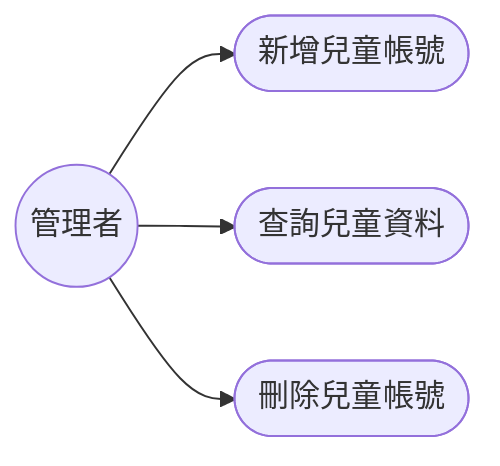
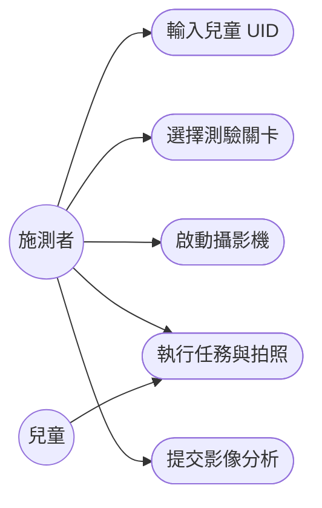
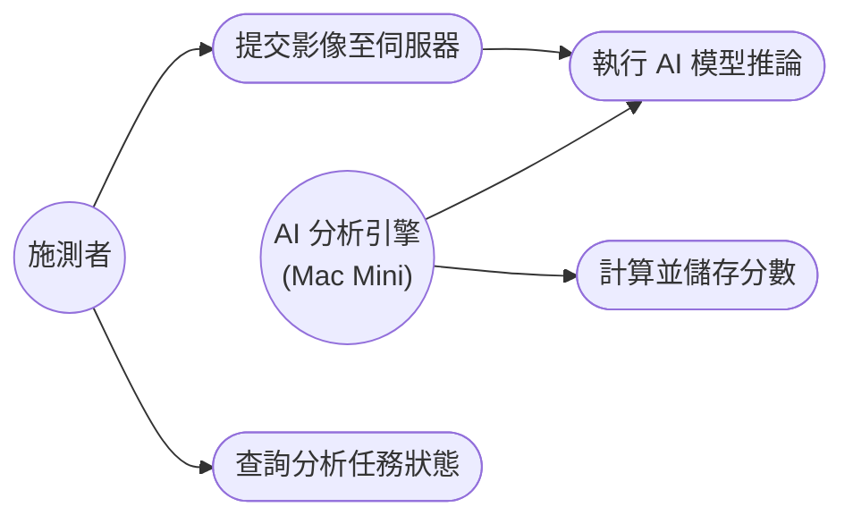
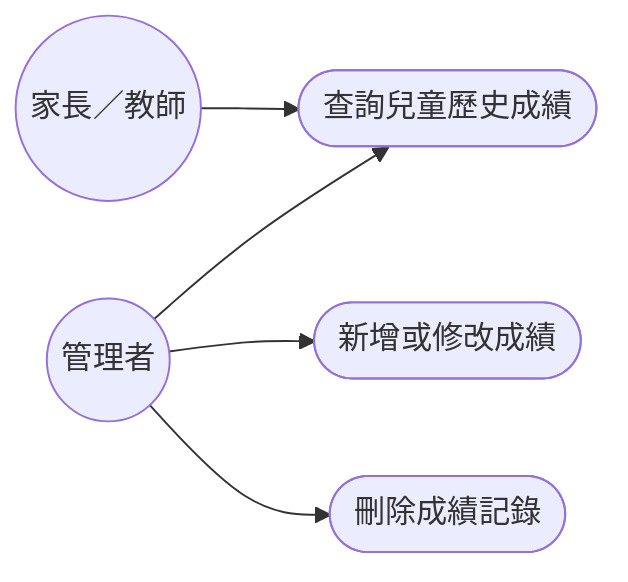
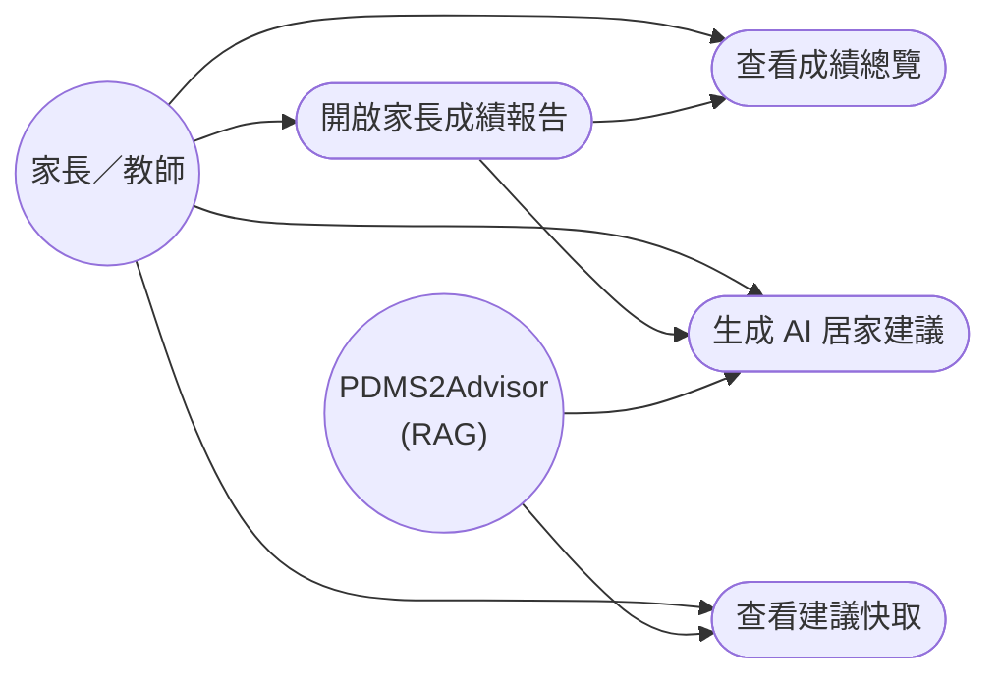
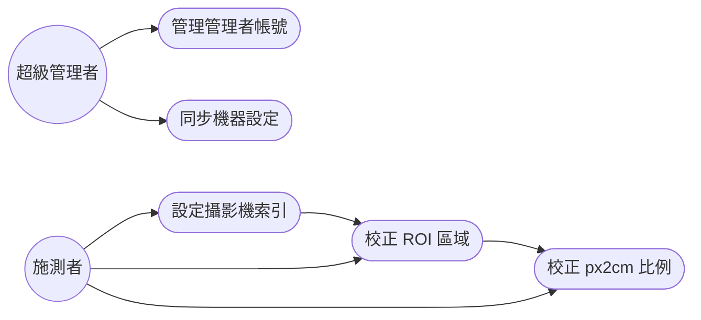

# 第五章：使用案例圖

本章依課程第五章格式，根據系統提供的 6 大功能域各繪製一張使用案例圖。  
依據設計文件書 FMD-DD-001 v1.0（2026-05-23）撰寫，圖表使用 Mermaid `graph LR` 語法。

---

## UC-01　兒童帳號管理

**參與執行者：** 管理者

---

## UC-02　進行精細動作測驗

**參與執行者：** 施測者、兒童

---

## UC-03　AI 影像分析與評分

**參與執行者：** 施測者、AI 分析引擎（Mac Mini）

---

## UC-04　成績管理與查詢

**參與執行者：** 管理者、家長／教師

---

## UC-05　生成 AI 居家建議

**參與執行者：** 家長／教師、PDMS2Advisor

---

## UC-06　系統設定與機器管理

**參與執行者：** 超級管理者、施測者

