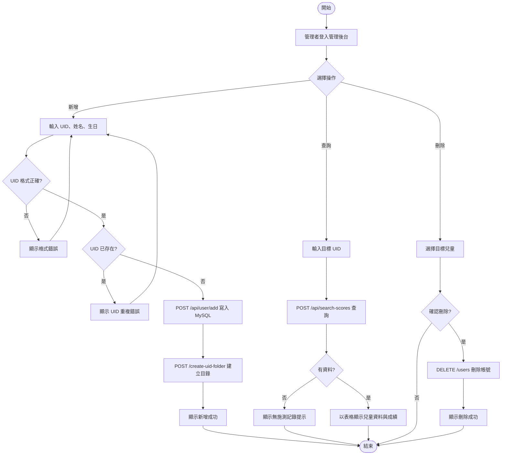
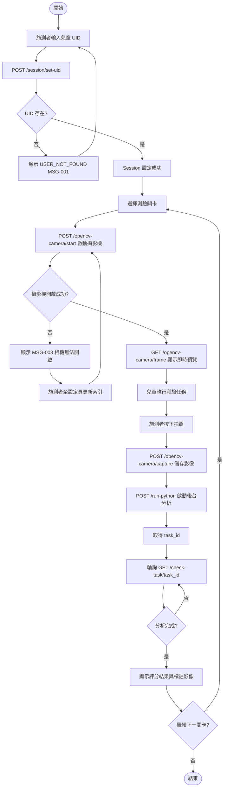
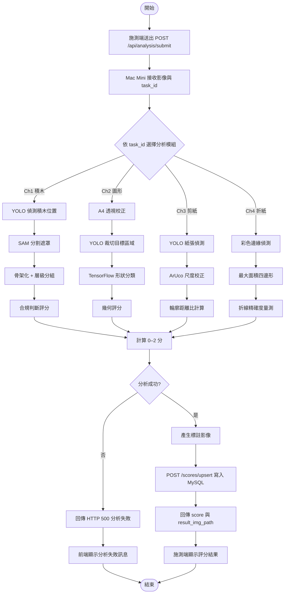
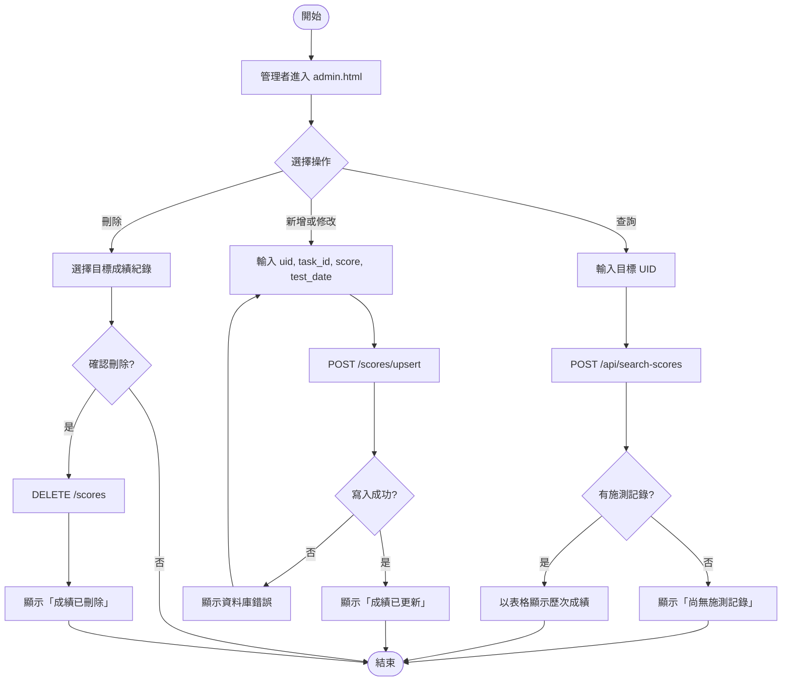
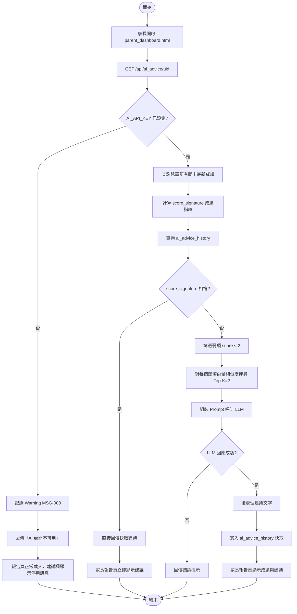
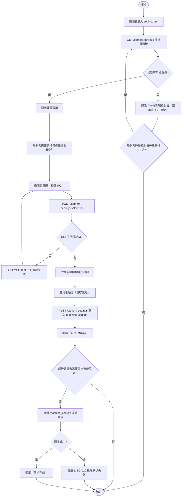

# 第七章：活動圖

本章依課程第七章格式，根據 6 個使用案例圖及其配合的使用案例描述，各提供一張完整活動圖。  
依據設計文件書 FMD-DD-001 v1.0（2026-05-23）撰寫，圖表使用 Mermaid `flowchart TD` 語法。

---

## UC-01　兒童帳號管理活動圖

---

## UC-02　進行精細動作測驗活動圖

---

## UC-03　AI 影像分析與評分活動圖

---

## UC-04　成績管理與查詢活動圖

---

## UC-05　生成 AI 居家建議活動圖

---

## UC-06　系統設定與機器管理活動圖

