```mermaid
classDiagram

    %% =========================================
    %% 資料實體層（對應 MySQL 資料表）
    %% =========================================

    class User {
        +String uid
        +String name
        +Date birthday
        +getAgeInMonths() int
    }

    class AdminUser {
        +String account
        +String password_hash
        +String email
        +int level
        +verify(password) bool
    }

    class Task {
        +String task_id
        +String task_name
    }

    class ScoreRecord {
        +String uid
        +String task_id
        +Date test_date
        +Time time
        +int score
        +String result_img_path
        +String data1
    }

    class AIAdviceHistory {
        +int id
        +String uid
        +String advice
        +String score_signature
        +DateTime updated_at
    }

    class MachineConfig {
        +String machine_id
        +String machine_name
        +String hostname
        +int top_camera_index
        +int side_camera_index
        +int roi_x
        +int roi_y
        +int roi_w
        +int roi_h
        +double px2cm
        +double standard_area
        +sync() bool
    }

    %% =========================================
    %% AI 分析服務層（模型推論，執行於 Mac Mini）
    %% =========================================

    class AIAnalyzer {
        <<abstract>>
        +String task_id
        +analyze(image_path, uid) Dict
    }

    class BlockAnalyzer {
        +analyze(image_path, uid) Dict
        +detectWithYOLO(image) List
        +segmentWithSAM(masks) List
        +groupByLayer(masks) Dict
        +checkCompliance(layers) int
    }

    class DrawingAnalyzer {
        +analyze(image_path, uid) Dict
        +correctPerspective(image) Mat
        +classifyWithTF(image) String
        +geometricScore(contour) int
        +calibrateArUco(image) float
    }

    class CuttingAnalyzer {
        +analyze(image_path, uid) Dict
        +detectPaperYOLO(image) BBox
        +calibrateArUco(image) float
        +calcDistanceRatio(paper, cut) float
    }

    class FoldingAnalyzer {
        +analyze(image_path, uid) Dict
        +detectEdges(image) List
        +findMaxQuad(edges) List
        +measureAccuracy(quad) float
    }

    class InstrumentAnalyzer {
        +String arduino_port
        +int baud_rate
        +analyze(uid) Dict
        +sendStart() void
        +readSerial() String
        +updateStateFile(state) void
    }

    class PyramidChecker {
        +run(image) int
        -detectBlocks() List
        -segmentMasks() List
    }

    class LayerGrouping {
        +groupByY(masks) Dict
        +validateStructure(groups) bool
    }

    class MaskAnalyzer {
        +analyzeContour(mask) Dict
        +skeletonize(mask) ndarray
    }

    class StairChecker {
        +run(image) int
        +checkStairPattern(groups) bool
    }

    class Analyze_graphics {
        +run(image) int
        -cropTarget() ndarray
        -evaluateScore() int
    }

    class CircleOrOval {
        +classify(image) String
    }

    class PaperDetector_YOLO {
        +detect(image) BoundingBox
    }

    class BoxDistanceAnalyzer {
        +analyzeContourRatio(mask, scale) float
        +evaluate(ratio) int
    }

    class PaperDetector_Edge {
        +detectFoldLine(image) LineSegment
        +evaluate(line) int
    }

    class PDMS2Advisor {
        +String model_name
        +generate_advice(uid) String
        +getWeakItems(uid) List
        +calcScoreSignature(scores) String
        +checkCache(uid, sig) String
        +vectorSearch(task_id, top_k) List
        +buildPrompt(weak_items, contexts) String
        +saveCache(uid, advice, sig) void
    }

    %% =========================================
    %% 後端應用層（Flask 三主程式）
    %% =========================================

    class FlaskApp {
        <<abstract>>
        +String host
        +int port
        +run() void
    }

    class TestingApp {
        +String current_uid
        +setUID(uid) bool
        +getUID() String
        +clearUID() bool
        +startCamera(camera_index, task_id) bool
        +stopCamera() bool
        +getFrame() String
        +captureImage(task_id, uid) String
        +submitAnalysis(task_id, uid) String
        +checkTask(task_id) Dict
        +getAIAdvice(uid) String
        +getCameraSettings() Dict
        +saveCameraSettings(settings) Dict
        +selectROI(camera_index, role) Dict
    }

    class AdminApp {
        +addUser(uid, name, birthday) bool
        +getUsers() List
        +upsertScore(uid, task_id, score, date, time) bool
        +deleteScore(uid, task_id, date) bool
        +getScores() List
        +getAdminList() List
        +addAdmin(account, password, email, level) bool
        +updateAdmin(account, email, level) bool
        +deleteAdmin(account) bool
        +login(account, password) Dict
        +logout() bool
    }

    class ServerApp {
        +submitAnalysis(images, uid, img_id) Dict
        +getAIAdvice(uid) String
        +login(account, password) Dict
        +getUIDs() List
        +getImages(uid) List
    }

    class CameraController {
        +int top_index
        +int side_index
        +bool is_running
        +start(camera_index, task_id) bool
        +stop() bool
        +getFrame() String
        +capture(task_id, uid) String
        +selectROI(camera_index, role) Dict
        +scanDevices() List
    }

    %% =========================================
    %% 前端控制層（JavaScript Controllers）
    %% =========================================

    class CameraPage {
        +startCamera() void
        +capturePhoto() void
        +stopCamera() void
        +streamFrame() void
    }

    class TaskPage {
        +loadTask(taskId) void
        +submitImage(uid, taskId) void
        +pollResult(taskId) void
        +showScore(score) void
    }

    class AdminPage {
        +searchScores(uid) void
        +upsertScore(data) void
        +deleteScore(uid, taskId) void
        +manageUsers() void
    }

    class MainPage {
        +selectChapter(ch) void
        +navigateToTask(taskId) void
    }

    %% =========================================
    %% 繼承關係
    %% =========================================

    FlaskApp <|-- TestingApp
    FlaskApp <|-- AdminApp
    FlaskApp <|-- ServerApp

    AIAnalyzer <|-- BlockAnalyzer
    AIAnalyzer <|-- DrawingAnalyzer
    AIAnalyzer <|-- CuttingAnalyzer
    AIAnalyzer <|-- FoldingAnalyzer
    AIAnalyzer <|-- InstrumentAnalyzer

    %% =========================================
    %% 組合與使用關係
    %% =========================================

    BlockAnalyzer --> PyramidChecker : 協調
    BlockAnalyzer --> StairChecker : 協調
    PyramidChecker --> LayerGrouping : 使用
    PyramidChecker --> MaskAnalyzer : 使用
    StairChecker --> LayerGrouping : 使用

    DrawingAnalyzer --> Analyze_graphics : 協調
    Analyze_graphics --> CircleOrOval : 使用

    CuttingAnalyzer --> PaperDetector_YOLO : 使用
    PaperDetector_YOLO --> BoxDistanceAnalyzer : 使用

    FoldingAnalyzer --> PaperDetector_Edge : 使用

    TestingApp --> CameraController : 使用
    TestingApp --> PDMS2Advisor : 請求建議
    ServerApp --> AIAnalyzer : 派發分析任務
    ServerApp --> PDMS2Advisor : 請求建議
    AdminApp --> User : 管理
    AdminApp --> AdminUser : 管理
    AdminApp --> ScoreRecord : 管理
    MachineConfig --> CameraController : 設定

    PDMS2Advisor --> AIAdviceHistory : 讀寫快取

    User "1" --> "0..*" ScoreRecord : 擁有
    Task "1" --> "0..*" ScoreRecord : 對應
    User "1" --> "0..1" AIAdviceHistory : 快取建議

    TaskPage --> CameraPage : 使用
    TaskPage --> MainPage : 使用
    AdminPage --> MainPage : 使用
```

# 第八章：類別圖

本章依課程第八章格式，提供整個資訊系統的完整類別圖。  
依據設計文件書 FMD-DD-001 v1.0 § 2.2 系統範圍類別圖及附錄 B 檔案與程式對照表撰寫。  
使用 Mermaid `classDiagram` 語法，分為四層：資料實體層、AI 分析服務層、後端應用層、前端控制層。

---

---

## 類別說明

### 資料實體層（DB Entity）

| 類別 | MySQL 資料表 | 說明 |
|------|------------|------|
| `User` | `user_list` | 兒童基本資料，uid 為主鍵 |
| `AdminUser` | `admin_users` | 管理者帳號，level 1–3 對應一般／進階／超級管理者 |
| `Task` | `task_list` | 17 個子關卡的 task_id 與資料表名稱對照 |
| `ScoreRecord` | `score_list` + 17 個任務子表（如 pyramid、draw_circle） | 施測紀錄與各關卡 0–2 分評分結果 |
| `AIAdviceHistory` | `ai_advice_history` | RAG 建議快取，以 score_signature 避免重複呼叫 LLM |
| `MachineConfig` | `machine_configs` | 各施測機器的 UUID、攝影機設定與 ROI 校正值 |

### AI 分析服務層（Analysis Service，抽象層 + 實作層）

| 類別 | 對應檔案 | 說明 |
|------|---------|------|
| `AIAnalyzer`（抽象） | — | 定義 analyze() 介面，5 個具體分析器繼承 |
| `BlockAnalyzer` | ch1-t2~t4 分析模組 | 協調 YOLO → SAM → 骨架化 → 層級分組 |
| `DrawingAnalyzer` | ch2-t1~t6 分析模組 | 協調透視校正 → TF 分類 → 幾何評分 |
| `CuttingAnalyzer` | ch3-t1~t4 分析模組 | 紙張偵測 → ArUco 校正 → 距離比評分 |
| `FoldingAnalyzer` | ch4-t1~t2 分析模組 | 邊緣偵測 → 最大四邊形 → 折線精確度 |
| `InstrumentAnalyzer` | ch5-t1/main.py | Arduino 序列通訊，本機執行，側重計數 |
| `PDMS2Advisor` | utils/rag_advisor.py | RAG 核心：向量搜尋 + LLM 生成 + 快取管理 |

### 後端應用層（Flask Application）

| 類別 | 部署位置 | Port | 說明 |
|------|---------|------|------|
| `TestingApp` | 施測端 PC | 8000 | Session 管理、相機控制、非同步分析任務派發 |
| `AdminApp` | 施測端 PC | 8001 | 兒童帳號與成績 CRUD、管理者帳號管理 |
| `ServerApp` | Mac Mini M2 Pro | 3000 | 接收影像後派發 AI 分析，回傳評分結果 |

### 前端控制層（Frontend Controller，JS）

| 類別 | 對應 JS | 說明 |
|------|---------|------|
| `CameraPage` | camera.js | 攝影機開關、拍照、串流控制 |
| `TaskPage` | task.js | 任務流程控制、提交影像、輪詢分析結果 |
| `AdminPage` | admin.js | 管理後台 UI 邏輯 |
| `MainPage` | script.js | 關卡選擇頁與章節導航 |
