# 使用案例規格與詞彙表

**文件編號：** FMD-UC-001  
**系統名稱：** 運用 AI 技術判別精細動作之早期遲緩篩檢系統  
**版本：** v1.0  
**日期：** 2026-05-27  
**撰寫團隊：** 洪偉城、林政維、呂昊宸、林宛瑩  
**指導教授：** 趙一平教授  

---

## 目錄

1. [類別圖](#1-類別圖)
2. [使用案例圖](#2-使用案例圖)
3. [使用案例描述](#3-使用案例描述)
4. [活動圖](#4-活動圖)
5. [詞彙表](#5-詞彙表)

---

## 1. 類別圖

整個資訊系統的完整類別圖如下，涵蓋三端 Flask 應用、資料模型、AI 分析模組、RAG 建議模組與相機控制模組。

```mermaid
classDiagram
    class FlaskApp {
        <<abstract>>
        +String host
        +int port
        +run() void
    }

    class TestingApp {
        +String current_uid
        +setUID(uid) bool
        +getUID() String
        +clearUID() bool
        +startCamera(camera_index, task_id) bool
        +stopCamera() bool
        +getFrame() String
        +captureImage(task_id, uid) String
        +submitAnalysis(task_id, uid) String
        +checkTask(task_id) Dict
        +getAIAdvice(uid) String
        +getCameraSettings() Dict
        +saveCameraSettings(settings) Dict
        +selectROI(camera_index, role) Dict
    }

    class AdminApp {
        +addUser(uid, name, birthday) bool
        +getUsers() List
        +upsertScore(uid, task_id, score, date, time) bool
        +deleteScore(uid, task_id, date) bool
        +getScores() List
        +getAdminList() List
        +addAdmin(account, password, email, level) bool
        +updateAdmin(account, email, level) bool
        +deleteAdmin(account) bool
        +login(account, password) Dict
        +logout() bool
    }

    class ServerApp {
        +submitAnalysis(images, uid, img_id) Dict
        +getAIAdvice(uid) String
        +login(account, password) Dict
        +getUIDs() List
        +getImages(uid) List
    }

    class CameraController {
        +int top_index
        +int side_index
        +bool is_running
        +start(camera_index, task_id) bool
        +stop() bool
        +getFrame() String
        +capture(task_id, uid) String
        +selectROI(camera_index, role) Dict
        +scanDevices() List
    }

    class AIAnalyzer {
        <<abstract>>
        +String task_id
        +analyze(image_path, uid) Dict
    }

    class BlockAnalyzer {
        +analyze(image_path, uid) Dict
        +detectWithYOLO(image) List
        +segmentWithSAM(masks) List
        +groupByLayer(masks) Dict
        +checkCompliance(layers) int
    }

    class DrawingAnalyzer {
        +analyze(image_path, uid) Dict
        +correctPerspective(image) Mat
        +classifyWithTF(image) String
        +geometricScore(contour) int
        +calibrateArUco(image) float
    }

    class CuttingAnalyzer {
        +analyze(image_path, uid) Dict
        +detectPaperYOLO(image) BBox
        +calibrateArUco(image) float
        +calcDistanceRatio(paper, cut) float
    }

    class FoldingAnalyzer {
        +analyze(image_path, uid) Dict
        +detectEdges(image) List
        +findMaxQuad(edges) List
        +measureAccuracy(quad) float
    }

    class InstrumentAnalyzer {
        +String arduino_port
        +int baud_rate
        +analyze(uid) Dict
        +sendStart() void
        +readSerial() String
        +updateStateFile(state) void
    }

    class PDMS2Advisor {
        +String model_name
        +generate_advice(uid) String
        +getWeakItems(uid) List
        +calcScoreSignature(scores) String
        +checkCache(uid, sig) String
        +vectorSearch(task_id, top_k) List
        +buildPrompt(weak_items, contexts) String
        +saveCache(uid, advice, sig) void
    }

    class User {
        +String uid
        +String name
        +Date birthday
        +getAgeInMonths() int
    }

    class AdminUser {
        +String account
        +String password_hash
        +String email
        +int level
        +verify(password) bool
    }

    class Task {
        +String task_id
        +String task_name
    }

    class ScoreRecord {
        +String uid
        +String task_id
        +Date test_date
        +Time time
        +int score
        +String result_img_path
        +String data1
    }

    class AIAdviceHistory {
        +int id
        +String uid
        +String advice
        +String score_signature
        +DateTime updated_at
    }

    class MachineConfig {
        +String machine_id
        +String machine_name
        +String hostname
        +int top_camera_index
        +int side_camera_index
        +int roi_x
        +int roi_y
        +int roi_w
        +int roi_h
        +double px2cm
        +double standard_area
        +sync() bool
    }

    FlaskApp <|-- TestingApp
    FlaskApp <|-- AdminApp
    FlaskApp <|-- ServerApp

    AIAnalyzer <|-- BlockAnalyzer
    AIAnalyzer <|-- DrawingAnalyzer
    AIAnalyzer <|-- CuttingAnalyzer
    AIAnalyzer <|-- FoldingAnalyzer
    AIAnalyzer <|-- InstrumentAnalyzer

    TestingApp --> CameraController : uses
    TestingApp --> PDMS2Advisor : requests
    ServerApp --> AIAnalyzer : delegates
    ServerApp --> PDMS2Advisor : requests
    AdminApp --> User : manages
    AdminApp --> AdminUser : manages
    AdminApp --> ScoreRecord : manages
    MachineConfig --> CameraController : configures

    User "1" --> "0..*" ScoreRecord : has
    Task "1" --> "0..*" ScoreRecord : referenced by
    User "1" --> "0..1" AIAdviceHistory : cached in
```

---

## 2. 使用案例圖

本系統提供六大功能領域，對應六張使用案例圖：

| 編號 | 功能領域 | 主要參與者 |
|------|----------|-----------|
| UC01 | 兒童帳號管理 | 管理者 |
| UC02 | 施測關卡執行 | 施測者、兒童 |
| UC03 | AI 影像分析與評分 | 施測者（觸發）、Mac Mini 伺服器（執行） |
| UC04 | 成績查詢與管理 | 管理者、家長／教師 |
| UC05 | AI 居家建議查閱 | 家長／教師 |
| UC06 | 系統設定與機器管理 | 超級管理者、施測者 |

---

### 2.1 UC01 – 兒童帳號管理

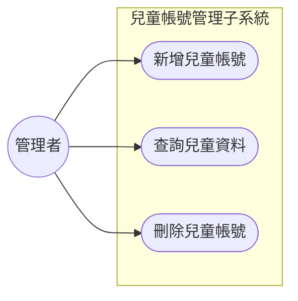

---

### 2.2 UC02 – 施測關卡執行

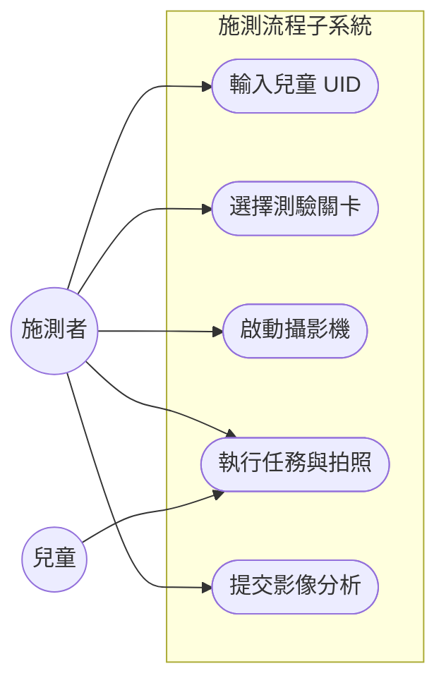

---

### 2.3 UC03 – AI 影像分析與評分

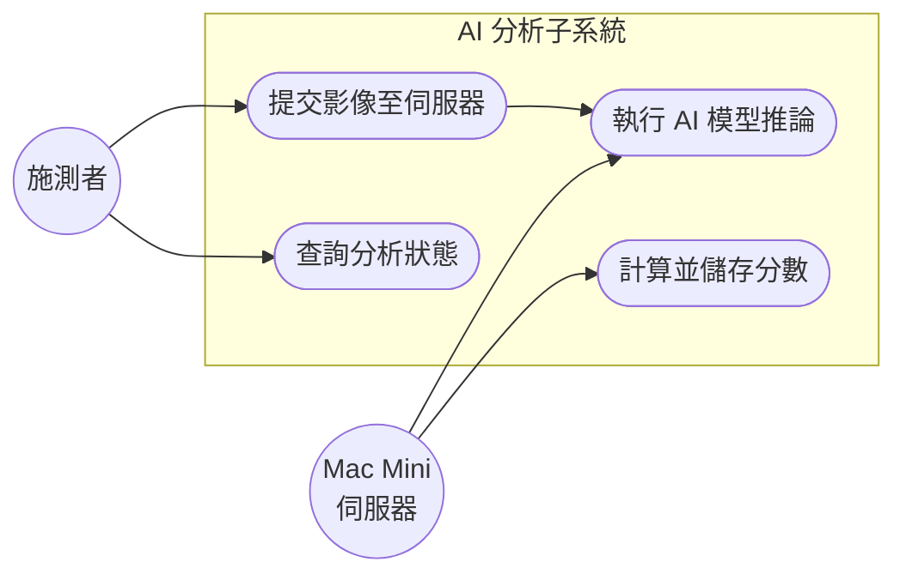

---

### 2.4 UC04 – 成績查詢與管理

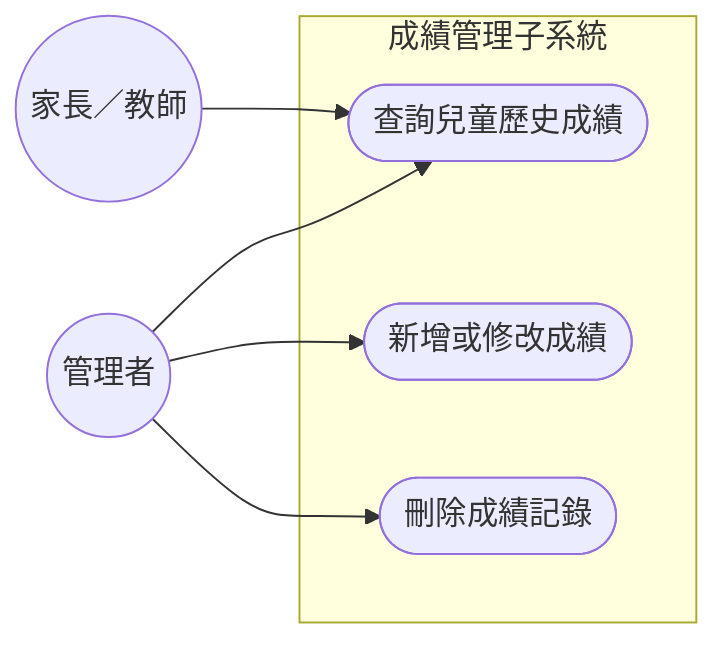

---

### 2.5 UC05 – AI 居家建議查閱

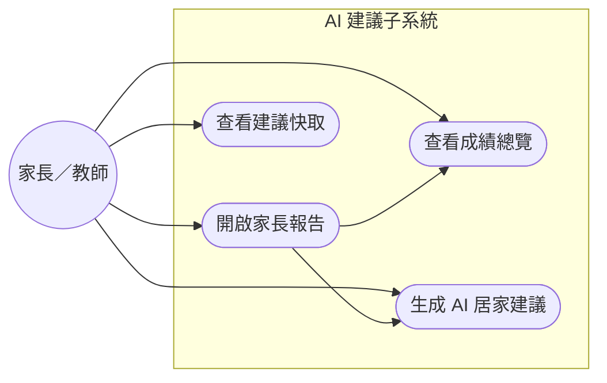

---

### 2.6 UC06 – 系統設定與機器管理

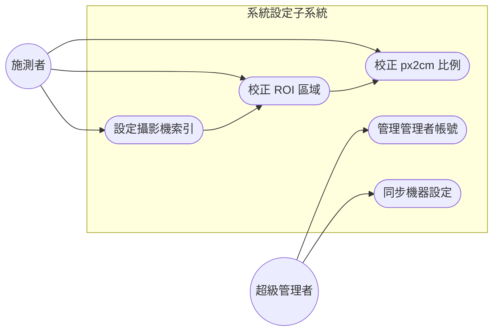

---

## 3. 使用案例描述

### 3.1 UC01 – 兒童帳號管理

#### UC01-N1　正常情節：新增兒童帳號

| 項目 | 說明 |
|------|------|
| 使用案例 ID | UC01-N1 |
| 名稱 | 新增兒童帳號 |
| 參與者 | 管理者 |
| 前置條件 | 管理者已成功登入管理後台（admin.html） |
| 後置條件 | 新兒童帳號已寫入 `user_list` 資料表；兒童影像資料夾已建立 |
| 正常流程 | 1. 管理者進入管理後台（`admin.html`） |
| | 2. 點選「新增兒童」按鈕 |
| | 3. 輸入兒童 UID、姓名、生日 |
| | 4. 系統驗證 UID 不含特殊字元（`/ \ : * ? " < > \|`） |
| | 5. 系統確認 UID 在 `user_list` 中不重複 |
| | 6. 系統呼叫 `POST /api/user/add`，寫入 MySQL `user_list` |
| | 7. 系統呼叫 `POST /create-uid-folder`，建立 `kid/{uid}/` 目錄 |
| | 8. 系統顯示「新增成功」確認訊息 |

#### UC01-E1　例外情節：UID 已存在

| 項目 | 說明 |
|------|------|
| 使用案例 ID | UC01-E1 |
| 名稱 | 新增兒童帳號 — UID 重複 |
| 參與者 | 管理者 |
| 前置條件 | 管理者已登入；輸入的 UID 已存在於 `user_list` |
| 觸發條件 | 步驟 5 檢查到 UID 與現有記錄重複 |
| 例外流程 | 1. 管理者完成輸入並點選送出 |
| | 2. 系統呼叫 `POST /api/user/add` |
| | 3. MySQL 回傳 Duplicate Entry 錯誤 |
| | 4. 系統顯示「UID 已存在，請更換」錯誤訊息（MSG-001 變體） |
| | 5. 介面回到輸入狀態，UID 欄位清空 |
| 後置條件 | 未新增任何資料；`user_list` 不變 |

---

### 3.2 UC02 – 施測關卡執行

#### UC02-N1　正常情節：完成單一關卡施測

| 項目 | 說明 |
|------|------|
| 使用案例 ID | UC02-N1 |
| 名稱 | 完成單一關卡施測 |
| 參與者 | 施測者、兒童 |
| 前置條件 | 兒童帳號已建立；攝影機已連接；施測端已連線至 Mac Mini（Tailscale） |
| 後置條件 | 影像已存入 `kid/{uid}/` 目錄；分析任務已提交至伺服器 |
| 正常流程 | 1. 施測者開啟施測端首頁（`start.html`） |
| | 2. 輸入兒童 UID，系統呼叫 `POST /session/set-uid` 驗證並儲存 |
| | 3. 系統導向關卡選擇頁（`index.html`） |
| | 4. 施測者點選目標關卡（如 Ch1-t2 堆金字塔） |
| | 5. 系統載入任務引導故事頁（`task.html`），播放示範影片 |
| | 6. 施測者點選「開始相機」，系統呼叫 `POST /opencv-camera/start` |
| | 7. 攝影機啟動，`camera.html` 顯示即時預覽 |
| | 8. 兒童依指示完成操作 |
| | 9. 施測者按下「拍照」，系統呼叫 `POST /opencv-camera/capture` |
| | 10. 影像以 `{task_id}.jpg` 格式存入 `kid/{uid}/` |
| | 11. 施測者點選「分析」，系統呼叫 `POST /run-python` |
| | 12. 系統顯示「分析中...」並輪詢 `GET /check-task/<task_id>` |
| | 13. 分析完成後顯示得分與結果影像 |

#### UC02-E1　例外情節：相機無法開啟

| 項目 | 說明 |
|------|------|
| 使用案例 ID | UC02-E1 |
| 名稱 | 施測中途攝影機無法開啟 |
| 參與者 | 施測者 |
| 前置條件 | 兒童 UID 已驗證；但 USB 攝影機未正確連接 |
| 觸發條件 | `POST /opencv-camera/start` 回傳 `success: false`（MSG-003） |
| 例外流程 | 1. 施測者點選「開始相機」 |
| | 2. 系統嘗試開啟所有攝影機索引（0–N） |
| | 3. 全部失敗，回傳 `{success: false, error: "無法開啟任何相機"}`（HTTP 500） |
| | 4. 前端顯示「相機無法開啟，請確認裝置連線」 |
| | 5. 施測者重新插拔攝影機或至「相機設定」更新索引後重試 |
| 後置條件 | 未拍照；未建立分析任務 |

#### UC02-E2　例外情節：UID 不存在

| 項目 | 說明 |
|------|------|
| 使用案例 ID | UC02-E2 |
| 名稱 | 輸入不存在的兒童 UID |
| 參與者 | 施測者 |
| 前置條件 | 施測端首頁已開啟 |
| 觸發條件 | 施測者輸入的 UID 在 `user_list` 中不存在 |
| 例外流程 | 1. 施測者輸入 UID 並按確認 |
| | 2. 系統呼叫 `POST /session/set-uid`，查詢 MySQL |
| | 3. MySQL 回傳查無此 UID |
| | 4. 系統回傳 `{success: false, code: "USER_NOT_FOUND"}`（HTTP 404） |
| | 5. 顯示「此使用者不存在，請請管理者建立帳號」（MSG-001） |
| 後置條件 | Session UID 未設定；系統停留在輸入頁 |

---

### 3.3 UC03 – AI 影像分析與評分

#### UC03-N1　正常情節：影像分析成功取得分數

| 項目 | 說明 |
|------|------|
| 使用案例 ID | UC03-N1 |
| 名稱 | 影像分析成功取得分數 |
| 參與者 | 施測者（觸發）、Mac Mini 伺服器（執行） |
| 前置條件 | 影像已存入 `kid/{uid}/{task_id}.jpg`；Mac Mini 已透過 Tailscale 連線 |
| 後置條件 | 分數已寫入對應任務子表與 `score_list`；結果標註影像已儲存 |
| 正常流程 | 1. 施測端呼叫 `POST /run-python`，帶入 `{id, uid}` |
| | 2. 施測端將影像上傳至 Mac Mini `POST /api/analysis/submit`（multipart） |
| | 3. Mac Mini 依 `task_id` 選取對應 AI 分析模組（Ch1–Ch5） |
| | 4. 模組執行影像前處理（ArUco 校正、ROI 裁切等） |
| | 5. 執行 AI 推論（YOLO / SAM / TensorFlow / 幾何計算） |
| | 6. 計算得分（0–3）並產生標註結果影像 |
| | 7. 回傳 `{ok: true, score, result_img_path}` 至施測端 |
| | 8. 施測端呼叫 MySQL，將結果寫入任務子表與 `score_list` |
| | 9. `GET /check-task/<task_id>` 回傳 `status: done, result: {...}` |

#### UC03-E1　例外情節：遠端 API 逾時

| 項目 | 說明 |
|------|------|
| 使用案例 ID | UC03-E1 |
| 名稱 | 遠端分析 API 請求逾時 |
| 參與者 | 施測者、Mac Mini 伺服器 |
| 前置條件 | 影像已上傳；Mac Mini 目前高負載或 Tailscale 網路不穩 |
| 觸發條件 | HTTP 請求超過逾時閾值，Mac Mini 未在時限內回傳結果 |
| 例外流程 | 1. 施測端呼叫 `POST /api/analysis/submit` |
| | 2. 請求超時，requests 拋出 Timeout 例外 |
| | 3. 施測端回傳 `{success: false, error: "遠端 API 請求失敗"}`（HTTP 500） |
| | 4. 前端顯示「分析失敗，請重新提交」 |
| | 5. 施測者可選擇重試或跳過此關卡 |
| 後置條件 | 未寫入任何分數；`score_list` 及任務子表不變 |

---

### 3.4 UC04 – 成績查詢與管理

#### UC04-N1　正常情節：查詢兒童歷史成績

| 項目 | 說明 |
|------|------|
| 使用案例 ID | UC04-N1 |
| 名稱 | 查詢兒童歷史成績 |
| 參與者 | 管理者 |
| 前置條件 | 管理者已登入後台；目標兒童已存在且有施測記錄 |
| 後置條件 | 成績清單顯示於畫面（無資料庫寫入） |
| 正常流程 | 1. 管理者進入後台成績頁面（`admin.html`） |
| | 2. 輸入或選擇兒童 UID |
| | 3. 系統呼叫 `POST /api/search-scores`，查詢 `score_list` 與各任務子表 |
| | 4. 系統以表格呈現所有歷次施測日期、關卡、得分 |
| | 5. 管理者可依日期篩選或匯出 |

#### UC04-E1　例外情節：兒童無任何成績記錄

| 項目 | 說明 |
|------|------|
| 使用案例 ID | UC04-E1 |
| 名稱 | 查詢成績時無資料 |
| 參與者 | 管理者 |
| 前置條件 | 管理者已登入；兒童帳號存在但尚未進行任何施測 |
| 觸發條件 | `score_list` 查詢結果為空 |
| 例外流程 | 1. 管理者輸入 UID 並查詢 |
| | 2. MySQL 回傳空結果集 |
| | 3. 系統顯示「此兒童尚無施測記錄」提示 |
| 後置條件 | 畫面顯示提示訊息；資料庫不變 |

---

### 3.5 UC05 – AI 居家建議查閱

#### UC05-N1　正常情節：生成並查閱 AI 居家建議

| 項目 | 說明 |
|------|------|
| 使用案例 ID | UC05-N1 |
| 名稱 | 生成並查閱 AI 居家建議 |
| 參與者 | 家長／教師 |
| 前置條件 | AI_API_KEY 已設定於 `.env`；兒童至少有一筆成績記錄 |
| 後置條件 | AI 建議已呈現於家長報告頁；結果已快取至 `ai_advice_history` |
| 正常流程 | 1. 家長開啟家長報告頁（`parent_dashboard.html`） |
| | 2. 系統查詢兒童所有關卡最新成績 |
| | 3. 系統計算 `score_signature`（成績指紋） |
| | 4. 呼叫 `GET /api/ai_advice/<uid>` |
| | 5. PDMS2Advisor 比對 `ai_advice_history`，快取未命中 |
| | 6. 篩選弱項（`score < 2` 的關卡） |
| | 7. 對每個弱項在 ChromaDB 中向量搜尋（Top-K=2） |
| | 8. 組裝 Prompt，呼叫長庚大學機構 LLM API |
| | 9. 後處理建議文字（移除不當句子） |
| | 10. 寫入 `ai_advice_history` 快取 |
| | 11. 家長報告頁顯示成績總覽與 AI 居家建議 |

#### UC05-E1　例外情節：AI API 金鑰未設定

| 項目 | 說明 |
|------|------|
| 使用案例 ID | UC05-E1 |
| 名稱 | AI 建議不可用（金鑰缺失） |
| 參與者 | 家長／教師 |
| 前置條件 | `.env` 中 `AI_API_KEY` 未設定或為空 |
| 觸發條件 | PDMS2Advisor 初始化時偵測到金鑰缺失（MSG-008） |
| 例外流程 | 1. 家長開啟報告頁 |
| | 2. 系統嘗試初始化 PDMS2Advisor |
| | 3. 偵測到 `AI_API_KEY` 未設定，記錄 Warning |
| | 4. `GET /api/ai_advice/<uid>` 回傳固定文字「AI 顧問不可用。」 |
| | 5. 家長報告頁僅顯示成績總覽，建議欄位顯示「AI 顧問不可用」 |
| 後置條件 | 頁面正常載入；建議功能停用 |

#### UC05-E2　例外情節：快取命中，直接返回舊建議

| 項目 | 說明 |
|------|------|
| 使用案例 ID | UC05-E2 |
| 名稱 | 建議快取命中 |
| 參與者 | 家長／教師 |
| 前置條件 | 兒童成績與上次生成建議時相同（`score_signature` 相符） |
| 觸發條件 | PDMS2Advisor 在 `ai_advice_history` 中找到相同 `score_signature` |
| 例外流程 | 1. 家長開啟報告頁 |
| | 2. 系統計算 `score_signature` |
| | 3. PDMS2Advisor 查詢快取，找到相符記錄 |
| | 4. 直接回傳快取建議，**不呼叫 LLM API** |
| | 5. 家長報告頁立即顯示建議（回應速度顯著加快） |
| 後置條件 | `ai_advice_history` 不變；LLM API 未被呼叫 |

---

### 3.6 UC06 – 系統設定與機器管理

#### UC06-N1　正常情節：攝影機設定與 ROI 校正

| 項目 | 說明 |
|------|------|
| 使用案例 ID | UC06-N1 |
| 名稱 | 攝影機設定與 ROI 校正 |
| 參與者 | 施測者 |
| 前置條件 | 攝影機已實體連接；施測端 Flask 正在運行 |
| 後置條件 | 攝影機索引、ROI 座標、px2cm 已儲存至 `machine_configs` 並同步至 Mac Mini |
| 正常流程 | 1. 施測者進入設定頁面（`setting.html`） |
| | 2. 系統呼叫 `GET /camera-devices` 掃描可用裝置 |
| | 3. 施測者從下拉選單選擇 Top/Side 攝影機索引 |
| | 4. 施測者點選「選取 ROI」，系統呼叫 `POST /camera-settings/select-roi` |
| | 5. OpenCV 視窗彈出，施測者以滑鼠框選有效操作區域 |
| | 6. 系統回傳 ROI 座標 `{x, y, w, h}` |
| | 7. 施測者放置 ArUco 標記，點選「校正 px2cm」 |
| | 8. 系統自動計算像素/公分換算比例 |
| | 9. 施測者點選「儲存設定」，系統呼叫 `POST /camera-settings` |
| | 10. 設定寫入 `machine_configs`，同步至遠端 Mac Mini |

#### UC06-E1　例外情節：攝影機裝置不可用

| 項目 | 說明 |
|------|------|
| 使用案例 ID | UC06-E1 |
| 名稱 | 掃描攝影機時無裝置可用 |
| 參與者 | 施測者 |
| 前置條件 | 施測端未連接任何 USB 攝影機 |
| 觸發條件 | `GET /camera-devices` 回傳空裝置列表 |
| 例外流程 | 1. 施測者進入設定頁面 |
| | 2. 系統掃描所有可用攝影機索引 |
| | 3. 無裝置回應，回傳 `{devices: []}` |
| | 4. 設定頁顯示「未偵測到攝影機，請確認 USB 連線」 |
| | 5. 施測者連接攝影機後點選「重新掃描」 |
| 後置條件 | `machine_configs` 不變；設定未儲存 |

---

## 4. 活動圖

### 4.1 UC01 活動圖 – 兒童帳號管理

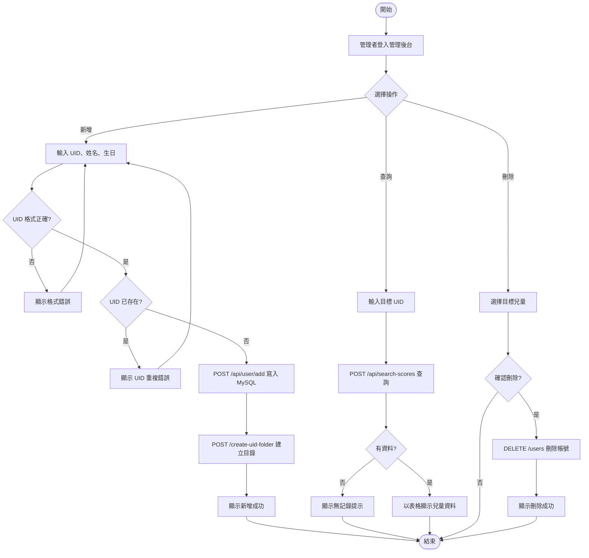

---

### 4.2 UC02 活動圖 – 施測關卡執行

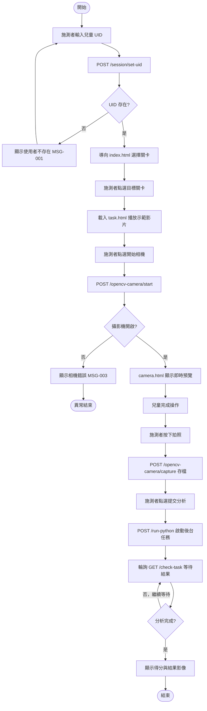

---

### 4.3 UC03 活動圖 – AI 影像分析與評分

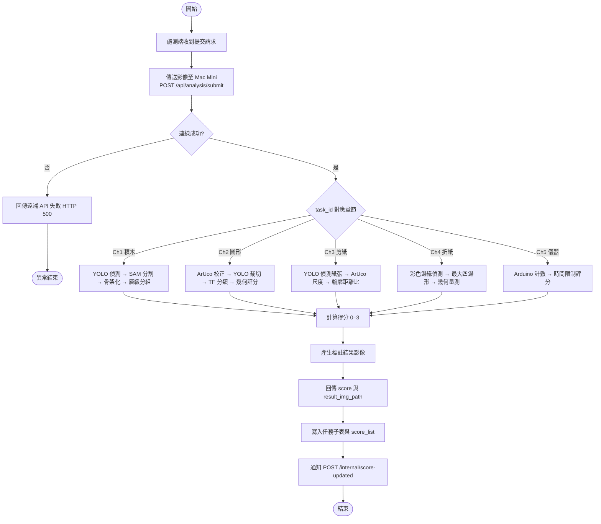

---

### 4.4 UC04 活動圖 – 成績查詢與管理

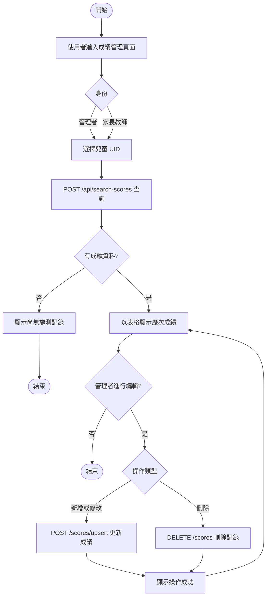

---

### 4.5 UC05 活動圖 – AI 居家建議查閱

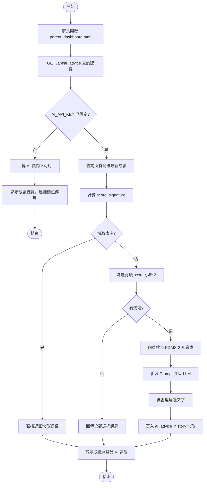

---

### 4.6 UC06 活動圖 – 系統設定與機器管理

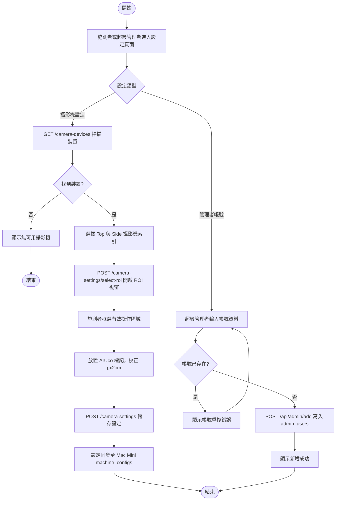

---

## 5. 詞彙表

| 詞彙 | 定義（解釋） | 備註 |
|------|-------------|------|
| 精細動作（Fine Motor Skills） | 手部、手指等小肌肉群的協調運動能力，包含抓握、描繪、剪裁等 | 本系統評估對象，有別於粗動作（大肌肉群） |
| 發展遲緩篩檢（Developmental Delay Screening） | 透過標準化測驗工具，提前辨識兒童在動作、語言或認知等發展領域是否落後同齡標準的過程 | 本系統聚焦於精細動作面向 |
| PDMS-2 | 皮巴迪動作發展量表第二版（Peabody Developmental Motor Scales, 2nd Edition），業界標準化兒童動作發展評估工具 | 本系統僅實作精細動作子量表（Ch1–Ch5） |
| UID（兒童唯一識別碼） | 系統為每位兒童指定的唯一字串 ID，用於關聯所有施測紀錄與影像資料 | 格式限制：不可含 `/ \ : * ? " < > \|` |
| 施測者 | 實際操作施測端設備、引導兒童完成測驗的人員，通常為衛生所護士或幼兒園教師 | 無需職能治療師資格 |
| 管理者 | 擁有後台帳號、負責管理兒童帳號與成績資料的人員，權限等級 1–2 | 不具系統設定權限（由超級管理者負責） |
| 超級管理者 | 最高權限使用者（level=3），可進行系統設定、機器管理與管理者帳號維護 | 對應 `superadmin.html` 介面 |
| 家長／教師 | 透過家長報告頁查閱兒童成績與 AI 居家建議的外部使用者 | 不需要管理者帳號，以 UID 查閱 |
| 關卡（Task） | 對應 PDMS-2 量表的一個子測項，如「堆金字塔（Ch1-t2）」、「畫圓形（Ch2-t1）」 | 共 17 個子關卡，編號格式為 Ch{章節}-t{題號} |
| 得分 | 每個關卡的評估結果，範圍 0–3，由 AI 自動計算 | 依 PDMS-2 評分標準，2 分以上視為通過 |
| 弱項 | 兒童在特定關卡得分低於 2 分者，作為 AI 居家建議的生成依據 | PDMS2Advisor 篩選條件：`score < 2` |
| score_signature（成績指紋） | 將兒童所有關卡最新成績序列化為字串，用於判斷 AI 建議是否需要重新生成 | 相同指紋表示成績未變，直接使用快取 |
| YOLO（You Only Look Once） | 即時物件偵測模型，用於偵測積木、剪紙等目標物件的邊界框與類別 | 本系統使用 Ultralytics v8，版本 8.3.217 |
| SAM（Segment Anything Model） | Meta 開發的通用影像分割模型，用於精確分割積木遮罩 | 與 YOLO 串聯使用（Ch1 章節） |
| TensorFlow | Google 開源深度學習框架，用於圖形描繪（Ch2）的形狀分類模型推論 | 版本 2.20.0 |
| ArUco 標記 | 一種方形基準標記（Fiducial Marker），貼於操作台上，用於影像的空間校正與 px2cm 換算 | OpenCV 內建支援 |
| ROI（Region of Interest） | 影像中的有效操作區域，由施測者手動框選後儲存至 machine_configs | 用於裁切無關背景，提升 AI 分析準確度 |
| px2cm（像素/公分換算比例） | 每公分對應的像素數，透過 ArUco 標記自動量測，用於幾何尺寸分析 | 每台施測機器各自校正 |
| RAG（Retrieval-Augmented Generation） | 檢索增強生成技術，結合向量資料庫搜尋與 LLM 生成，提供有根據的 AI 建議 | PDMS2Advisor 核心架構 |
| ChromaDB | 開源向量資料庫，用於儲存 PDMS-2 知識庫的嵌入向量，支援語意相似度搜尋 | 版本 1.5.9；資料存於 `rag_db/` |
| Embedding 模型 | 將文字轉換為向量表示的模型，本系統使用 `all-MiniLM-L6-v2`（HuggingFace） | 本地執行，不依賴外部 API |
| LLM（大型語言模型） | 用於生成 AI 居家建議的語言模型，本系統使用長庚大學機構雲端 LLM API | 透過 `AI_API_KEY` 環境變數設定 |
| Tailscale VPN | 基於 WireGuard 的點對點 VPN 服務，用於施測端（Windows PC）與伺服器（Mac Mini）之間的加密通訊 | 替代公共網路，提升資料傳輸安全性 |
| 三層式架構（Three-Tier Architecture） | 將系統分為展示層（前端 HTML）、邏輯層（Flask 應用）、資料層（MySQL）的標準軟體架構 | 本系統另加伺服器端（Mac Mini）做為 AI 計算節點 |
| 施測端 | 安裝於現場、負責介面互動與攝影機控制的 Windows PC，運行 `run.py`（port 8000） | 輕量節點，AI 推論在伺服器端執行 |
| 伺服器端 | 部署於 Mac Mini M2 Pro 的 Flask 服務（`web.py`，port 3000），負責 AI 模型推論與 RAG 建議生成 | 亦儲存 MySQL 資料庫 |
| DEMO 模式 | 以環境變數 `DEMO_MODE=true` 啟用，模擬攝影機操作，讀取預置圖片以供示範 | 無需實體攝影機，適合展示或測試 |
| Machine ID | 每台施測端的唯一 UUID，用於識別不同機器的設定（攝影機索引、ROI、px2cm） | 存於 `machine_configs.machine_id` |
| Arduino | 用於 Ch5 側重儀器關卡（collect_raisins）的微控制器，以序列通訊（9600 baud）回傳豆子計數與計時資訊 | 連接至施測端 USB，COM3（Windows） |
| 積木建構（Ch1） | PDMS-2 精細動作量表第一章，測項包含串珠、堆金字塔、堆階梯、蓋牆壁（共 4 題） | AI 策略：YOLO + SAM + 骨架化 |
| 圖形描繪（Ch2） | PDMS-2 第二章，測項包含畫圓、畫正方形、畫十字、畫直線、塗色、連連看（共 6 題） | AI 策略：TensorFlow + ArUco 幾何分析 |
| 剪紙（Ch3） | PDMS-2 第三章，測項包含剪圓形、剪正方形、剪紙、剪直線（共 4 題） | AI 策略：YOLO + ArUco + 輪廓距離比 |
| 折紙（Ch4） | PDMS-2 第四章，測項包含單次折紙、雙次折紙（共 2 題） | AI 策略：OpenCV 邊緣偵測 + 幾何量測 |
| 儀器量測（Ch5） | PDMS-2 第五章，測項為撿葡萄乾（collect_raisins），以 Arduino 計數並計時（共 1 題） | 本機執行，不經遠端 API |
| Parameterized Query | 資料庫參數化查詢，將使用者輸入作為參數而非字串拼接，防止 SQL Injection 攻擊 | PyMySQL 全面採用此方式 |

---

*本文件使用 Mermaid 語法繪製所有 UML 圖表，執行 `python3 gen_doc.py 使用案例規格與詞彙表_FMD_AI_Screener.md` 可自動 render 圖表並輸出 Word 格式。*
