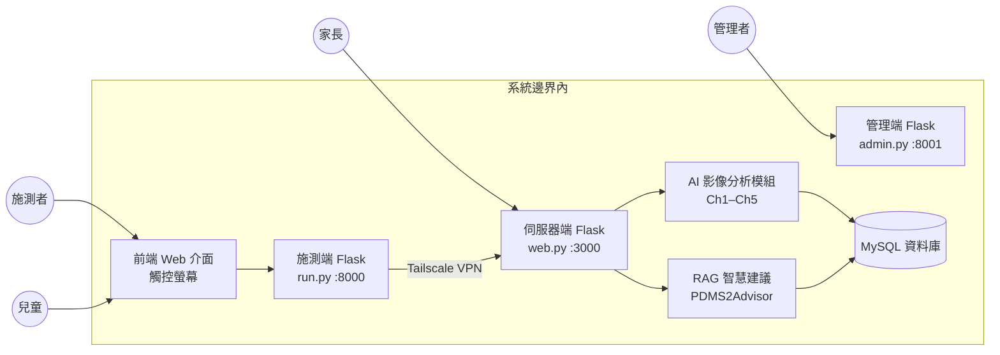
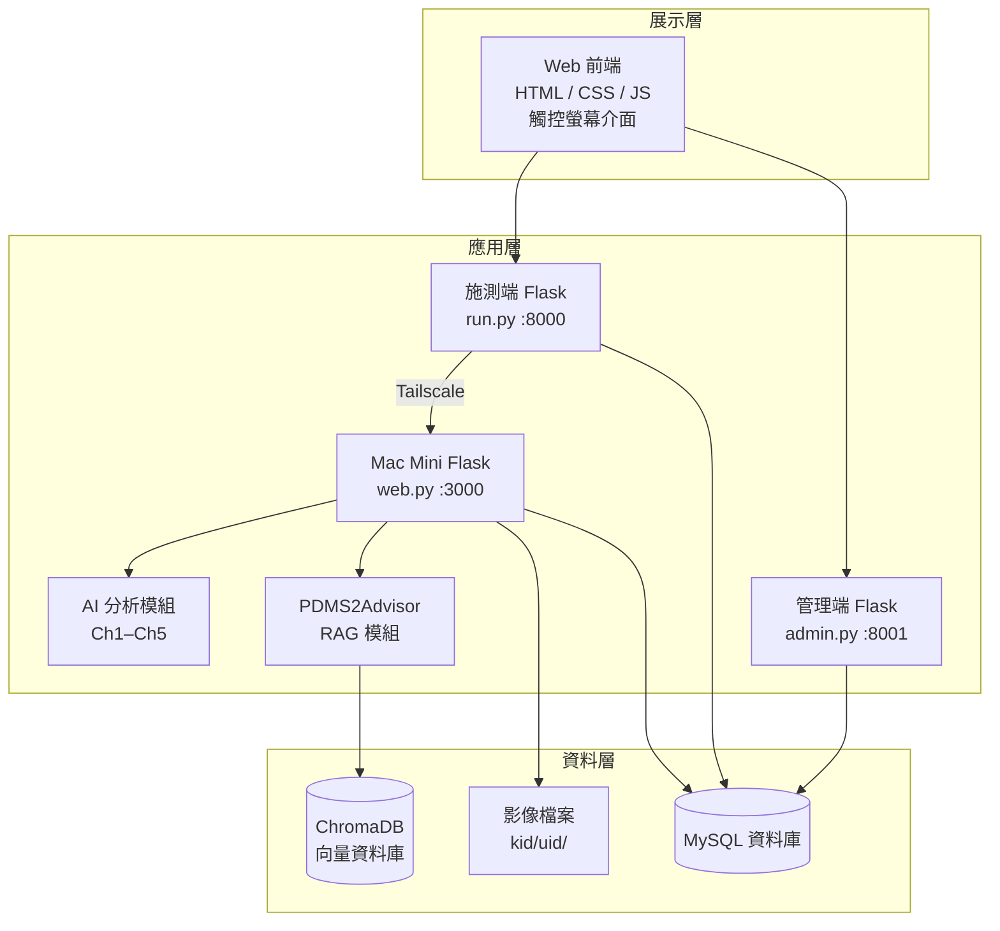
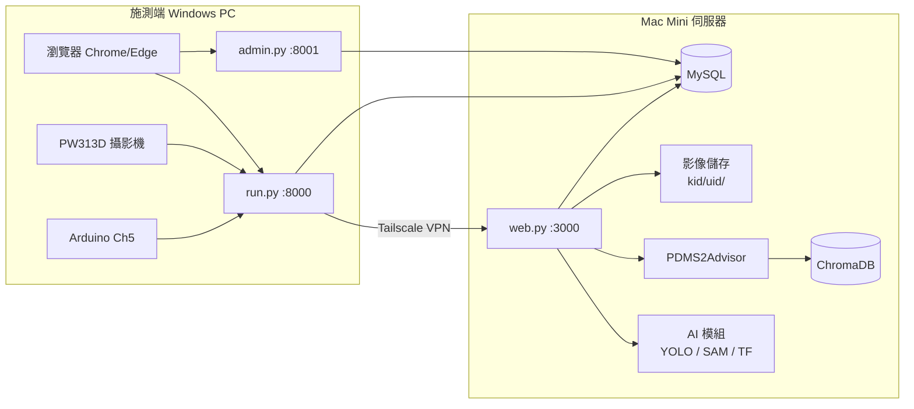
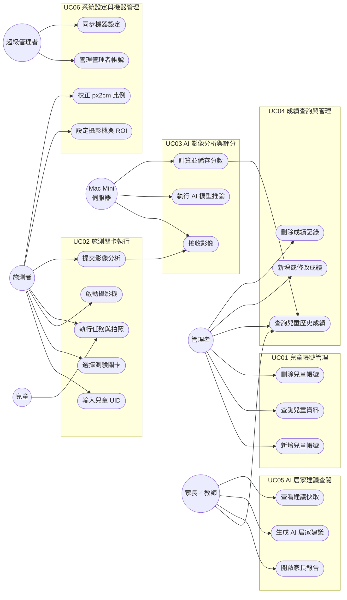
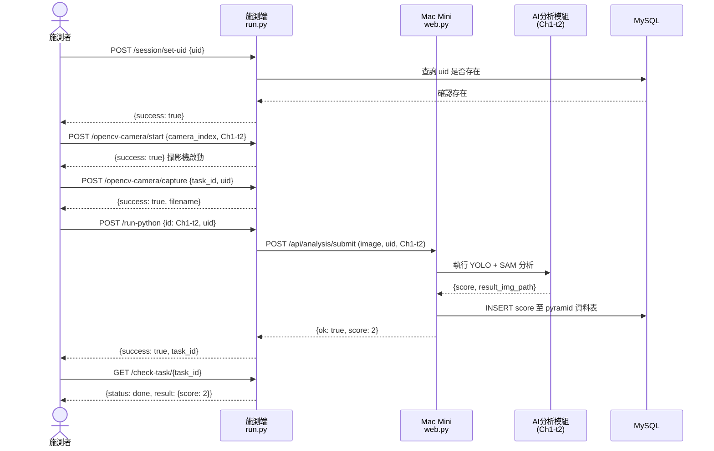
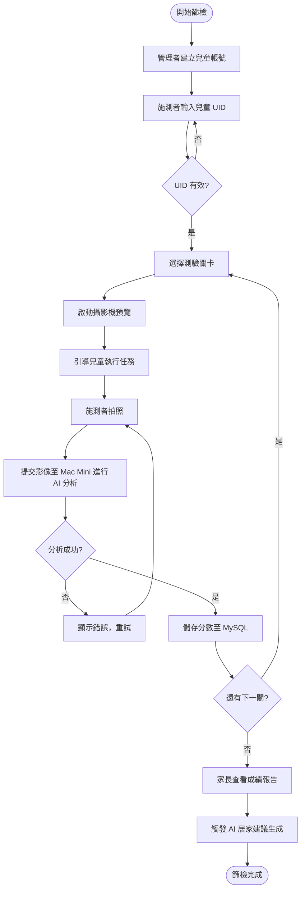

# 設計文件書

**文件編號：** FMD-DD-001  
**系統名稱：** 運用 AI 技術判別精細動作之早期遲緩篩檢系統  
**英文名稱：** AI-based Early Screening System for Fine Motor Developmental Delay Identification  
**版本：** v1.0  
**日期：** 2026-05-23  
**撰寫團隊：** 洪偉城、林政維、呂昊宸、林宛瑩  
**指導教授：** 趙一平教授  

---

## 目錄

1. [系統簡介](#1-系統簡介)
2. [系統概述](#2-系統概述)
3. [設計內容](#3-設計內容)
4. [需求制設計之追溯與版本管理](#4-需求制設計之追溯與版本管理)
5. [附錄](#附錄)

---

## 1. 系統簡介

### 1.1 規格目的

本文件為「運用 AI 技術判別精細動作之早期遲緩篩檢系統（FMD_AI_Screener）」之軟體設計文件書，依物件導向軟體設計課程規範撰寫，目的在於：

- 描述系統整體架構與模組設計，供開發、測試與維護人員參考
- 定義各軟硬體組件之介面規格與互動方式
- 作為需求追溯的依據，確保設計與需求一致
- 提供後續擴充（年齡範圍、題型擴增）的設計基礎

### 1.2 規格範圍

本文件涵蓋之系統範圍：

| 範圍項目 | 說明 |
|----------|----------|
| 適用年齡 | 4–6 歲兒童 |
| 評估量表基準 | PDMS-2（皮巴迪動作發展量表第二版） |
| 測驗題型 | 積木建構（Ch1）、圖形描繪（Ch2）、剪紙（Ch3）、折紙（Ch4）、儀器量測（Ch5），共 17 個子關卡 |
| 使用環境 | 偏鄉衛生所巡迴使用，可擴展至幼兒園 |
| 系統介面 | 觸控螢幕 Web 介面（前端）+ Flask 後端 + MySQL 資料庫 |
| 不包含範圍 | 粗動作評估、語言評估、認知評估、完整 PDMS-2 全量表 |

### 1.3 參考文件

| 編號 | 文件名稱 | 說明 |
|----------|----------|----------|
| [1] | PDMS-2 量表規範 | Peabody Developmental Motor Scales 2nd Edition |
| [2] | README.md | 本專案說明文件 |
| [3] | PDMS2_web/RAG/PDMS2.md | PDMS-2 題目對照知識庫 |
| [4] | RAG/Clinical_Context.md | 臨床背景知識文件 |
| [5] | Flask 官方文件 | https://flask.palletsprojects.com |
| [6] | Ultralytics YOLO 文件 | https://docs.ultralytics.com |
| [7] | LangChain 官方文件 | https://docs.langchain.com |
| [8] | ChromaDB 官方文件 | https://docs.trychroma.com |

---

## 2. 系統概述

### 2.1 系統目標

本系統旨在解決偏鄉地區兒童精細動作發展遲緩篩檢資源不足的問題，具體目標如下：

1. **降低施測門檻：** 無需職能治療師在場，非醫療背景人員可獨立操作
2. **遊戲化體驗：** 以故事情境包裝測驗，減少兒童抗拒，提升表現自然性
3. **自動化評分：** 結合 YOLO、SAM、TensorFlow 與幾何分析進行多階段 AI 評分
4. **雲端追蹤：** 以 MySQL 資料庫記錄兒童歷次測驗成績，支援縱向追蹤
5. **AI 諮詢建議：** 利用 RAG 架構，針對弱項自動生成職能治療師等級之居家建議
6. **可攜部署：** 五分鐘完成架設，適合巡迴服務

### 2.2 系統範圍



**系統邊界內：**
- 前端 Web 介面（觸控螢幕）
- 施測端 Flask 應用（run.py, port 8000）
- 伺服器端 Flask 應用（MacWeb/web.py, port 3000；admin.py, port 8001）
- AI 影像分析模組（Ch1–Ch5）
- RAG 智慧建議模組（PDMS2Advisor）
- MySQL 資料庫（兒童資料、成績、AI 建議快取）

**系統邊界外：**
- 完整 PDMS-2 量表的全項目評估
- 醫療診斷與治療
- 家長行動裝置應用程式

### 2.3 系統架構

本系統採用**三層式架構（Three-Tier Architecture）**，搭配 Tailscale VPN 實現遠端安全通訊：



### 2.4 軟/硬體建構項目需求概述

| 類別 | 項目 | 需求說明 |
|----------|----------|----------|
| **硬體** | 施測端主機 | Intel i5 以上，8GB RAM，Windows 11 |
| **硬體** | 攝影機 | PW313D 雙鏡頭網路攝影機（俯視 + 側視） |
| **硬體** | 觸控螢幕 | 14 吋 IPS 1080P，支援觸控輸入 |
| **硬體** | 伺服器 | Mac Mini M2 Pro（部署後端與資料庫） |
| **硬體** | Arduino | Ch5 儀器量測（側重計數器）使用 |
| **軟體** | 作業系統（施測端） | Windows 11 |
| **軟體** | 作業系統（伺服器） | macOS |
| **軟體** | Python 執行環境 | Python 3.9（施測端）/ 3.9+（伺服器） |
| **軟體** | 資料庫 | MySQL 8.0+ |
| **軟體** | 網路連線 | Tailscale VPN（外網安全通訊） |
| **軟體** | 瀏覽器 | Chrome / Edge（支援觸控） |

### 2.5 軟/硬體環境

#### 軟體環境（施測端）

| 項目 | 版本 / 說明 |
|----------|----------|
| OS | Windows 11 |
| Python | 3.9 |
| Flask | 3.1.2 |
| OpenCV | 4.12.0.88 |
| PyMySQL | 1.1.2 |
| Tailscale | 最新穩定版 |

#### 軟體環境（分析伺服器 / Mac Mini）

| 套件 | 版本 |
|----------|----------|
| Flask | 3.1.2 |
| OpenCV | 4.12.0.88 |
| Ultralytics (YOLO) | 8.3.217 |
| TensorFlow | 2.20.0 |
| PyTorch | 2.8.0 |
| LangChain | 0.3.30 |
| LangChain-Chroma | 0.2.6 |
| langchain-huggingface | 0.3.1 |
| ChromaDB | 1.5.9 |
| sentence-transformers | 5.1.2 |
| scikit-image | 0.24.0 |
| PyMySQL | 1.1.2 |

#### 硬體環境

| 設備 | 規格 |
|----------|----------|
| 施測端 PC | Intel i5+，8GB RAM，1TB SSD |
| 攝影機 | PW313D 雙鏡頭，1080P，USB |
| 觸控螢幕 | 14 吋，IPS，1920×1080 |
| Mac Mini（伺服器） | M2 Pro，16GB RAM，512GB SSD |
| Arduino | Uno（Ch5 側重儀器搭配使用） |

### 2.6 一般限制

| 限制類型 | 說明 |
|----------|----------|
| **網路依賴** | 施測時需透過 Tailscale 連線至 Mac Mini，斷線將無法上傳影像與取得分析結果 |
| **作業系統** | 施測端限 Windows 11（YOLO/SAM 模型推論在伺服器端執行，本機僅需輕量 Flask） |
| **年齡範圍** | 目前僅支援 4–6 歲，不同年齡的評分標準需另行擴充 |
| **語言** | 系統介面為繁體中文；AI 建議預設以繁體中文輸出 |
| **AI API 金鑰** | RAG 建議需設定 `AI_API_KEY`（`.env`）；使用長庚大學機構雲端 LLM API |
| **儲存空間** | 每位兒童的影像與錄影快取存於 `kid/{uid}/` 目錄，需預留足夠磁碟空間 |
| **攝影機數量** | Ch5 使用側面攝影機（Side），其他章節使用上方攝影機（Top） |

---

## 3. 設計內容

### 3.1 軟/硬體建構項目架構

#### 3.1.1 軟體模組架構圖

```
FMD_AI_Screener/
├── PDMS2_web/                    # 施測端主程式
│   ├── run.py                    # 施測端 Flask 主程式（port 8000）
│   ├── admin.py                  # 管理端 Flask 主程式（port 8001）
│   ├── utils/
│   │   └── rag_advisor.py        # PDMS2Advisor（RAG 智慧建議）
│   ├── html/                     # 前端 HTML 頁面
│   │   ├── start.html            # 起始頁（UID 輸入）
│   │   ├── index.html            # 關卡選擇頁
│   │   ├── camera.html           # 相機控制頁
│   │   ├── task.html             # 任務引導頁
│   │   ├── admin.html            # 管理者後台
│   │   ├── admin_login.html      # 管理者登入
│   │   ├── superadmin.html       # 超級管理者
│   │   ├── parent_dashboard.html # 家長成績報告
│   │   └── setting.html          # 系統設定
│   ├── js/                       # 前端 JavaScript
│   ├── css/                      # 前端樣式
│   ├── ch1-t1/ ~ ch1-t4/        # 積木建構分析模組
│   ├── ch2-t1/ ~ ch2-t6/        # 圖形描繪分析模組
│   ├── ch3-t1/ ~ ch3-t4/        # 剪紙分析模組
│   ├── ch4-t1/ ~ ch4-t2/        # 折紙分析模組
│   ├── ch5-t1/                   # 儀器量測模組（本機執行）
│   ├── rag_db/                   # ChromaDB 向量資料庫（持久化）
│   └── model_cache/              # HuggingFace 本地模型快取
├── MacWeb/                       # 伺服器端主程式
│   └── web.py                    # Mac Mini Flask 主程式（port 3000）
├── RAG/                          # 知識庫文件
│   ├── PDMS2.md                  # PDMS-2 題目標準對照表
│   └── Clinical_Context.md       # 臨床背景知識
└── scratch/                      # 測試與工具腳本
```

#### 3.1.2 部署架構圖



---

### 3.2 軟硬體組件設計說明

#### 3.2.1 主要類別設計（Class Diagram）

```mermaid
classDiagram
    class FlaskApp {
        <<abstract>>
        +String host
        +int port
        +run() void
    }

    class TestingApp {
        +String current_uid
        +setUID(uid) bool
        +getUID() String
        +clearUID() bool
        +startCamera(camera_index, task_id) bool
        +stopCamera() bool
        +getFrame() String
        +captureImage(task_id, uid) String
        +submitAnalysis(task_id, uid) String
        +checkTask(task_id) Dict
        +getAIAdvice(uid) String
        +getCameraSettings() Dict
        +saveCameraSettings(settings) Dict
        +selectROI(camera_index, role) Dict
    }

    class AdminApp {
        +addUser(uid, name, birthday) bool
        +getUsers() List
        +upsertScore(uid, task_id, score, date, time) bool
        +deleteScore(uid, task_id, date) bool
        +getScores() List
        +getAdminList() List
        +addAdmin(account, password, email, level) bool
        +updateAdmin(account, email, level) bool
        +deleteAdmin(account) bool
        +login(account, password) Dict
        +logout() bool
    }

    class ServerApp {
        +submitAnalysis(images, uid, img_id) Dict
        +getAIAdvice(uid) String
        +login(account, password) Dict
        +getUIDs() List
        +getImages(uid) List
    }

    class CameraController {
        +int top_index
        +int side_index
        +bool is_running
        +start(camera_index, task_id) bool
        +stop() bool
        +getFrame() String
        +capture(task_id, uid) String
        +selectROI(camera_index, role) Dict
        +scanDevices() List
    }

    class AIAnalyzer {
        <<abstract>>
        +String task_id
        +analyze(image_path, uid) Dict
    }

    class BlockAnalyzer {
        +analyze(image_path, uid) Dict
        +detectWithYOLO(image) List
        +segmentWithSAM(masks) List
        +groupByLayer(masks) Dict
        +checkCompliance(layers) int
    }

    class DrawingAnalyzer {
        +analyze(image_path, uid) Dict
        +correctPerspective(image) Mat
        +classifyWithTF(image) String
        +geometricScore(contour) int
        +calibrateArUco(image) float
    }

    class CuttingAnalyzer {
        +analyze(image_path, uid) Dict
        +detectPaperYOLO(image) BBox
        +calibrateArUco(image) float
        +calcDistanceRatio(paper, cut) float
    }

    class FoldingAnalyzer {
        +analyze(image_path, uid) Dict
        +detectEdges(image) List
        +findMaxQuad(edges) List
        +measureAccuracy(quad) float
    }

    class InstrumentAnalyzer {
        +String arduino_port
        +int baud_rate
        +analyze(uid) Dict
        +sendStart() void
        +readSerial() String
        +updateStateFile(state) void
    }

    class PDMS2Advisor {
        +String model_name
        +generate_advice(uid) String
        +getWeakItems(uid) List
        +calcScoreSignature(scores) String
        +checkCache(uid, sig) String
        +vectorSearch(task_id, top_k) List
        +buildPrompt(weak_items, contexts) String
        +saveCache(uid, advice, sig) void
    }

    class User {
        +String uid
        +String name
        +Date birthday
        +getAgeInMonths() int
    }

    class AdminUser {
        +String account
        +String password_hash
        +String email
        +int level
        +verify(password) bool
    }

    class Task {
        +String task_id
        +String task_name
    }

    class ScoreRecord {
        +String uid
        +String task_id
        +Date test_date
        +Time time
        +int score
        +String result_img_path
        +String data1
    }

    class AIAdviceHistory {
        +int id
        +String uid
        +String advice
        +String score_signature
        +DateTime updated_at
    }

    class MachineConfig {
        +String machine_id
        +String machine_name
        +String hostname
        +int top_camera_index
        +int side_camera_index
        +int roi_x
        +int roi_y
        +int roi_w
        +int roi_h
        +double px2cm
        +double standard_area
        +sync() bool
    }

    FlaskApp <|-- TestingApp
    FlaskApp <|-- AdminApp
    FlaskApp <|-- ServerApp

    AIAnalyzer <|-- BlockAnalyzer
    AIAnalyzer <|-- DrawingAnalyzer
    AIAnalyzer <|-- CuttingAnalyzer
    AIAnalyzer <|-- FoldingAnalyzer
    AIAnalyzer <|-- InstrumentAnalyzer

    TestingApp --> CameraController : uses
    TestingApp --> PDMS2Advisor : requests
    ServerApp --> AIAnalyzer : delegates
    ServerApp --> PDMS2Advisor : requests
    AdminApp --> User : manages
    AdminApp --> AdminUser : manages
    AdminApp --> ScoreRecord : manages
    MachineConfig --> CameraController : configures

    User "1" --> "0..*" ScoreRecord : has
    Task "1" --> "0..*" ScoreRecord : referenced by
    User "1" --> "0..1" AIAdviceHistory : cached in
```



#### 3.2.2 任務對照表（TASK_MAP）

| task_id | 資料表名稱 | 關卡說明 |
|----------|----------|----------|
| Ch1-t1 | string_blocks | 積木串珠 |
| Ch1-t2 | pyramid | 堆金字塔 |
| Ch1-t3 | stair | 堆階梯 |
| Ch1-t4 | build_wall | 蓋牆壁 |
| Ch2-t1 | draw_circle | 畫圓形 |
| Ch2-t2 | draw_square | 畫正方形 |
| Ch2-t3 | draw_cross | 畫十字 |
| Ch2-t4 | draw_line | 畫直線 |
| Ch2-t5 | color | 塗色 |
| Ch2-t6 | connect_dots | 連連看 |
| Ch3-t1 | cut_circle | 剪圓形 |
| Ch3-t2 | cut_square | 剪正方形 |
| Ch3-t3 | cut_paper | 剪紙 |
| Ch3-t4 | cut_line | 剪直線 |
| Ch4-t1 | one_fold | 單次折紙 |
| Ch4-t2 | two_fold | 雙次折紙 |
| Ch5-t1 | collect_raisins | 撿葡萄乾（側重儀器） |

#### 3.2.3 AI 分析流程設計

**各章節分析策略：**

| 章節 | 分析策略 | 使用技術 |
|----------|----------|----------|
| Ch1 積木 | 偵測 → SAM 分割 → 骨架化 → 層級分組 → 規則判斷 | YOLO + SAM + OpenCV skeletonize |
| Ch2 圖形 | A4 校正 → YOLO 裁切 → TensorFlow 分類 → 幾何評分 | YOLO + TensorFlow + ArUco |
| Ch3 剪紙 | YOLO 紙張偵測 → ArUco 尺度校正 → 輪廓距離比計算 | YOLO + ArUco + OpenCV |
| Ch4 折紙 | 彩色邊緣偵測 → 最大面積四邊形 → 幾何量測 | OpenCV Edge Detection |
| Ch5 儀器 | Arduino 即時回傳 → 豆子計數 → 時間限制評分 | Arduino + OpenCV + 本機執行 |

#### 3.2.4 RAG 模組設計（PDMS2Advisor）

```
初始化流程：
  1. 清除損壞的模型快取（0-byte 檔案）
  2. 載入本地 Embedding 模型（all-MiniLM-L6-v2）
  3. 若 ChromaDB 已存在 → 直接載入；否則 → 解析 PDMS2.md + Clinical_Context.md 並建立向量索引
  4. 確認 ai_advice_history 資料表 schema
  5. 初始化 LLM（ChatOpenAI，使用機構 AI API）

建議生成流程：
  1. 查詢兒童所有關卡最新成績
  2. 計算 score_signature（成績指紋）
  3. 若快取命中（score_signature 相同）→ 直接返回快取
  4. 篩選弱項（score < 2）
  5. 對每個弱項進行向量相似度搜尋（Top-K=2）
  6. 組裝 Prompt → 呼叫 LLM
  7. 後處理（移除不當句子）
  8. 寫入 ai_advice_history 快取
  9. 返回建議文字
```

---

### 3.3 介面設計說明

#### 3.3.1 前端頁面介面

| 頁面檔案 | 說明 | 主要使用者 |
|----------|----------|----------|
| start.html | 起始頁，輸入兒童 UID，進入系統 | 施測者 |
| index.html | 關卡選擇主頁，顯示任務清單 | 兒童 / 施測者 |
| camera.html | 相機即時預覽，拍照送出 | 施測者 |
| task.html | 任務引導故事頁，嵌入示範影片 | 兒童 |
| admin.html | 管理後台，兒童帳號管理、成績查詢 | 管理者 |
| admin_login.html | 管理者登入頁 | 管理者 |
| superadmin.html | 超級管理者頁（系統設定、機器設定） | 超級管理者 |
| parent_dashboard.html | 家長成績報告，含 AI 建議 | 家長 / 教師 |
| setting.html | 攝影機設定、ROI 校正、px2cm 校正 | 施測者 |

#### 3.3.2 REST API 介面規格

**施測端（run.py, port 8000）**

| 方法 | 路徑 | 說明 | 請求格式 | 回應格式 |
|----------|----------|----------|----------|----------|
| POST | /session/set-uid | 設定兒童 UID | `{uid: string}` | `{success, uid}` |
| GET | /session/get-uid | 取得目前 UID | — | `{success, uid}` |
| POST | /session/clear-uid | 清除 UID | — | `{success}` |
| POST | /create-uid-folder | 建立兒童資料夾 | `{uid: string}` | `{success, uid}` |
| POST | /opencv-camera/start | 啟動攝影機 | `{camera_index, task_id}` | `{success}` |
| POST | /opencv-camera/stop | 停止攝影機 | — | `{success}` |
| GET | /opencv-camera/frame | 取得即時影像（Base64） | — | `{success, image}` |
| POST | /opencv-camera/capture | 拍照存檔 | `{task_id, uid}` | `{success, filename}` |
| POST | /run-python | 啟動後台分析任務 | `{id, uid}` | `{success, task_id}` |
| GET | /check-task/`<task_id>` | 查詢分析任務狀態 | — | `{status, result}` |
| POST | /test-score | 測試計分（Debug 用） | `{uid, task_id}` | `{success, score}` |
| GET | /api/ai_advice/`<uid>` | 取得 AI 建議 | — | `{ok, advice}` |
| GET | /camera-settings | 讀取相機設定 | — | `{success, settings}` |
| POST | /camera-settings | 更新相機設定 | `{top, side, px2cm, standard_area}` | `{success, settings}` |
| GET | /camera-devices | 掃描可用攝影機 | — | `{devices, settings}` |
| POST | /camera-settings/select-roi | 開啟 ROI 選取視窗 | `{camera_index, role}` | `{success, roi}` |
| POST | /api/search-scores | 搜尋成績 | `{uid, task_id}` | `{success, data}` |
| GET | /db/ping | 資料庫連線測試 | — | `{ok, version}` |
| GET | /game-state/`<uid>` | 取得 Ch5 遊戲狀態 | — | `{success, state}` |
| POST | /clear-game-state | 重置 Ch5 遊戲狀態 | `{uid}` | `{success}` |
| POST | /save-stair-type | 儲存 Ch1-t3 階梯類型 | `{stair_type}` | `{success}` |
| GET | /machine-configs | 取得機器設定 | — | JSON |
| GET | /logs/tail | 串流查看伺服器日誌 | — | text/event-stream |

**Mac Mini 伺服器端（MacWeb/web.py, port 3000）**

| 方法 | 路徑 | 說明 | 請求格式 | 回應格式 |
|----------|----------|----------|----------|----------|
| GET | / | 伺服器首頁 | — | HTML |
| POST | /api/auth/login | 登入驗證 | `{account, password}` | `{ok, user}` |
| GET | /api/auth/whoami | 取得目前登入者 | — | `{ok, logged_in, user}` |
| POST | /api/auth/logout | 登出 | — | `{ok}` |
| GET | /api/uids | 取得所有 UID | — | `{uids: [...]}` |
| GET | /api/images | 取得兒童圖片列表 | `?uid=` | JSON |
| GET | /images/`<uid>`/<filename> | 取得圖片檔案 | — | 圖片資料 |
| POST | /api/analysis/submit | 接收影像並執行 AI 分析 | multipart/form-data（images + uid + img_id） | `{ok, score, result_img_path}` |
| GET | /api/ai_advice/`<uid>` | 取得 AI 建議 | — | `{ok, advice}` |

**管理端（admin.py, port 8001）**

| 方法 | 路徑 | 說明 | 請求格式 | 回應格式 |
|----------|----------|----------|----------|----------|
| GET | / | 登入頁導向 | — | HTML |
| GET | /admin | 管理後台首頁 | — | HTML |
| GET | /admin.html | 管理後台頁面 | — | HTML |
| POST | /api/auth/login | 管理者登入 | `{account, password}` | `{ok, user}` |
| GET | /api/auth/whoami | 取得目前登入者 | — | `{ok, logged_in, user}` |
| POST | /api/auth/logout | 登出 | — | `{ok}` |
| POST | /api/auth/update_profile | 更新個人資料 | `{email}` | `{ok, msg}` |
| GET | /api/tasks | 取得所有任務列表 | — | `{ok, tasks}` |
| GET | /scores | 取得所有兒童成績 | — | HTML 或 JSON |
| GET | /users | 取得所有兒童帳號 | — | JSON |
| POST | /api/user/add | 新增兒童帳號 | `{uid, name, birthday}` | `{success}` |
| POST | /scores/upsert | 新增或更新單筆成績 | `{uid, task_id, score, test_date, time}` | `{success}` |
| DELETE | /scores | 刪除成績 | `?uid=&task_id=&test_date=` | `{success}` |
| GET | /events | 取得施測事件記錄 | — | JSON |
| POST | /internal/score-updated | 內部分數更新通知 | `{uid, task_id}` | `{ok}` |
| GET | /api/admin/list | 取得管理者帳號列表 | — | JSON |
| POST | /api/admin/add | 新增管理者帳號 | `{account, password, email, level}` | `{success}` |
| PUT | /api/admin/update/`<account>` | 更新管理者資料 | `{email, level}` | `{success}` |
| DELETE | /api/admin/delete/`<account>` | 刪除管理者帳號 | — | `{success}` |
| GET | /view-compare | 比較分析結果檢視 | — | HTML |
| GET | /api/ai_advice/`<uid>` | 取得 AI 建議 | — | `{ok, advice}` |

#### 3.3.3 資料庫介面

**資料表：user_list（兒童帳號）**

| 欄位 | 型別 | 約束 | 說明 |
|----------|----------|----------|----------|
| uid | VARCHAR(50) | PK | 兒童唯一識別碼 |
| name | VARCHAR(50) | NULL | 姓名 |
| birthday | DATE | NULL | 生日（用於計算月齡） |

**資料表：score_list（施測紀錄）**

| 欄位 | 型別 | 約束 | 說明 |
|----------|----------|----------|----------|
| uid | VARCHAR(50) | NOT NULL | 兒童 UID |
| task_id | VARCHAR(50) | NOT NULL | 任務 ID（如 Ch1-t2） |
| test_date | DATE | NOT NULL | 施測日期 |
| time | TIME | NOT NULL | 施測時間 |

**資料表：task_list（任務對照表）**

| 欄位 | 型別 | 約束 | 說明 |
|----------|----------|----------|----------|
| task_id | VARCHAR(50) | PK | 任務唯一識別碼 |
| task_name | VARCHAR(50) | NOT NULL | 對應資料表名稱 |

**資料表：admin_users（管理者帳號）**

| 欄位 | 型別 | 約束 | 說明 |
|----------|----------|----------|----------|
| account | VARCHAR(50) | PK | 管理者帳號 |
| password | VARCHAR(255) | NOT NULL | 密碼（雜湊值） |
| email | VARCHAR(100) | NOT NULL | 電子郵件 |
| level | TINYINT | NOT NULL, CHECK(1-3) | 權限等級（1=一般管理者, 2=進階, 3=超級管理者） |

**資料表：machine_configs（機器設定）**

| 欄位 | 型別 | 約束 | 說明 |
|----------|----------|----------|----------|
| machine_id | CHAR(36) | PK | 機器 UUID |
| machine_name | VARCHAR(100) | NOT NULL | 機器識別名稱 |
| hostname | VARCHAR(255) | NULL | 主機名稱 |
| top_camera_index | INT | NULL | 上方攝影機索引 |
| side_camera_index | INT | NULL | 側面攝影機索引 |
| roi_x | INT | NULL | 上方 ROI X 座標 |
| roi_y | INT | NULL | 上方 ROI Y 座標 |
| roi_w | INT | NULL | 上方 ROI 寬度 |
| roi_h | INT | NULL | 上方 ROI 高度 |
| side_roi_x | INT | NOT NULL, DEFAULT 0 | 側面 ROI X 座標 |
| side_roi_y | INT | NOT NULL, DEFAULT 0 | 側面 ROI Y 座標 |
| side_roi_w | INT | NOT NULL, DEFAULT 0 | 側面 ROI 寬度 |
| side_roi_h | INT | NOT NULL, DEFAULT 0 | 側面 ROI 高度 |
| px2cm | DOUBLE | NULL | 像素/公分換算比例 |
| standard_area | DOUBLE | NULL | 標準面積（像素） |
| updated_at | TIMESTAMP | NOT NULL, AUTO | 最後更新時間 |
| created_at | TIMESTAMP | NOT NULL | 建立時間 |

**資料表：machine_identities（機器身份）**

| 欄位 | 型別 | 約束 | 說明 |
|----------|----------|----------|----------|
| machine_id | CHAR(36) | PK | 機器 UUID（與 machine_configs 關聯） |
| hostname | VARCHAR(255) | NOT NULL | 主機名稱 |
| mac_address | VARCHAR(64) | NULL | 網卡 MAC 位址 |
| location_code | VARCHAR(100) | NULL | 場地代碼 |
| last_seen_at | TIMESTAMP | NULL | 最後連線時間 |
| created_at | TIMESTAMP | NOT NULL | 建立時間 |

**資料表：ai_advice_history（AI 建議快取）**

| 欄位 | 型別 | 約束 | 說明 |
|----------|----------|----------|----------|
| id | INT | NOT NULL | 主鍵（手動管理） |
| uid | VARCHAR(50) | NOT NULL | 兒童 UID |
| advice | TEXT | NULL | AI 生成的建議文字 |
| score_signature | TEXT | NULL | 成績指紋（用於快取命中判斷） |
| updated_at | TIMESTAMP | NOT NULL, AUTO | 更新時間 |

**資料表：各任務子表（如 pyramid, draw_circle, ...）**

| 欄位 | 型別 | 約束 | 說明 |
|----------|----------|----------|----------|
| uid | VARCHAR(50) | NOT NULL | 兒童 UID |
| test_date | DATE | NOT NULL | 施測日期 |
| time | TIME | NOT NULL | 施測時間 |
| score | INT | NULL | 得分（0–3） |
| result_img_path | VARCHAR(255) | NULL | 結果圖片路徑或簽名 URL |
| data1 | TEXT | NULL | 額外資料（選填） |

任務子表包含：string_blocks、pyramid、stair、build_wall、draw_circle、draw_square、draw_cross、draw_line、color、connect_dots、cut_circle、cut_square、cut_paper、cut_line、one_fold、two_fold、collect_raisins

---

### 3.4 作業程序設計說明

#### 3.4.1 使用案例圖（Use Case Diagram）



#### 3.4.2 主要流程循序圖（Sequence Diagram）

**施測完整流程（以 Ch1-t2 堆金字塔為例）：**



#### 3.4.3 活動圖（Activity Diagram）—— 整體篩檢流程



---

### 3.5 輸入/輸出設計說明

#### 3.5.1 輸入設計

| 輸入來源 | 輸入類型 | 說明 |
|----------|----------|----------|
| 施測者 | UID 字串 | 兒童唯一識別碼，由管理者預先建立 |
| 施測者 | 相機影像 | JPEG 格式，1280×720，由 PW313D 擷取 |
| 施測者 | ROI 座標 | 由 OpenCV selectROI 或手動輸入（x, y, w, h） |
| 施測者 | 相機索引 | 上方攝影機（Top）與側面攝影機（Side）索引號 |
| 施測者 | px2cm 比例尺 | ArUco 標記自動量測或手動輸入 |
| 系統 | Arduino 訊號 | Ch5 豆子計數即時回傳 |
| PDMS2.md | Markdown 文件 | PDMS-2 題目標準，作為 RAG 知識庫索引 |

#### 3.5.2 輸出設計

| 輸出類型 | 格式 | 說明 |
|----------|----------|----------|
| 評分結果 | JSON `{score: int}` | 每項關卡 0–3 分 |
| 標註影像 | JPEG / PNG | 含偵測框、分割遮罩、幾何標記的結果圖 |
| AI 居家建議 | Markdown 文字 | PDMS2Advisor 生成的職能治療師建議 |
| 家長報告 | HTML 頁面（可列印） | parent_dashboard.html，含成績總覽與 AI 建議 |
| 管理報表 | HTML 表格 | admin.html，含所有兒童歷次成績 |
| 記錄日誌 | console.txt | Flask 後端運行日誌，含錯誤與 Info |

#### 3.5.3 錯誤輸出設計

| 錯誤情境 | 回應格式 | HTTP 碼 |
|----------|----------|----------|
| UID 不存在 | `{success: false, code: "USER_NOT_FOUND"}` | 404 |
| 相機無法開啟 | `{success: false, error: "無法開啟任何相機"}` | 500 |
| 遠端 API 逾時 | `{success: false, error: "遠端 API 請求失敗"}` | 500 |
| DB 連線失敗 | `{ok: false, err: "..."}` | 500 |
| AI API 金鑰未設定 | `"AI 顧問不可用。"` | 200 |

---

### 3.6 其他設計說明

#### 3.6.1 安全性設計

| 設計項目 | 說明 |
|----------|----------|
| Session 管理 | Flask session 儲存 UID，`secret_key` 隨機產生（`secrets.token_hex(16)`） |
| UID 驗證 | 禁止含 `/`, `\`, `:`, `*`, `?`, `"`, `<`, `>`, `|` 等特殊字元 |
| 資料庫查詢 | 全面使用 Parameterized Query（PyMySQL），防止 SQL Injection |
| 網路通訊 | 施測端 ↔ 伺服器透過 Tailscale VPN 加密通道 |
| 環境變數 | DB 密碼、AI API Key 存於 `.env`，不納入版本控制 |

#### 3.6.2 Demo 模式設計

系統支援 `DEMO_MODE=true`（`.env` 設定），可在無實體攝影機環境下示範：
- 攝影機啟動模擬成功
- 拍照動作改為讀取預放圖片（`kid/{uid}/{task_id}.jpg`）
- 分析流程不受影響

#### 3.6.3 機器設定同步設計

每台施測端具有唯一 `MACHINE_ID`（UUID），攝影機設定與 ROI 校正值可同步至遠端 `machine_configs` 資料表，支援多機部署時的集中管理。

#### 3.6.4 Ch5 儀器量測設計

Ch5 側重儀器關卡（collect_raisins）為**本機執行**（非遠端 API），由施測端 Flask 直接啟動 `ch5-t1/main.py`，結果透過 `Ch5-t1_state.json` 檔案回傳，避免 Arduino USB 序列通訊的網路延遲問題。

**Arduino 序列通訊規格：**

| 項目 | 規格 |
|----------|----------|
| 連接埠 | COM3（Windows）、/dev/tty.usbmodem（macOS） |
| 鮜率 | 9600 baud |
| 通訊格式 | UTF-8 文字訊息 |
| 超時設定 | 0.1 秒 |

**序列訊息格式（Arduino → Flask）：**

| 訊息範例 | 意義 |
|----------|----------|
| `等待 Python` | Arduino 就緒，等待 Flask 啟動遊戲 |
| `進度: 3` | 已拾取 3 顆豆子 |
| `剩餘: 45s` | 剩餘 45 秒 |
| `違規` | 發生違規動作 |
| `最終得分等級 [2]` | 遊戲結束，得分為 2 分 |

**序列訊息格式（Flask → Arduino）：**

| 訊息 | 意義 |
|----------|----------|
| `R` | 啟動遊戲計時 |

**遊戲狀態檔案格式（Ch5-t1_state.json）：**

```json
{
  "running": true,
  "bean_count": 3,
  "remaining_time": 45,
  "target_bean_count": 10,
  "warning": false,
  "game_over": false,
  "score": -1
}
```

| 欄位 | 型別 | 說明 |
|----------|----------|----------|
| running | BOOLEAN | 遊戲是否正在執行 |
| bean_count | INT | 目前拾取豆子數量 |
| remaining_time | INT | 剩餘秒數（倒數 60 秒） |
| target_bean_count | INT | 目標豆子數量（固定 10） |
| warning | BOOLEAN | 是否發生違規 |
| game_over | BOOLEAN | 遊戲是否已結束 |
| score | INT | 最終得分（0–3），遊戲結束後才有意義 |

**執行流程：**
1. run.py 以 `subprocess.run()` 啟動 `ch5-t1/main.py`，傳入相機索引、錄影路徑、UID
2. main.py 初始化 Arduino 序列連線（COM3, 9600）
3. Arduino 發送 `等待 Python`，Flask 回傳 `R` 啟動計時
4. 遊戲中每幀更新 `Ch5-t1_state.json`（約每秒一次）
5. 遊戲結束後，main.py 以 `sys.exit(score)` 回傳分數
6. run.py 讀取 `Ch5-t1_state.json` 中的 score，寫入 MySQL

---

## 4. 需求制設計之追溯與版本管理

### 4.1 需求追溯矩陣

| 需求 ID | 需求說明 | 設計位置 | 實作檔案 |
|----------|----------|----------|----------|
| REQ-01 | 無需職能治療師即可施測 | § 2.1, § 3.4.3 | run.py, html/task.html |
| REQ-02 | 基於 PDMS-2 量表評分 | § 2.2, § 3.2.2 | ch1–ch5 各 main.py |
| REQ-03 | 自動化影像評分 | § 3.2.3 | ch1–ch5 分析模組 |
| REQ-04 | 以故事情境包裝測驗 | § 3.3.1 | html/task.html, html/index.html |
| REQ-05 | 雲端記錄兒童成績 | § 3.3.3, § 3.5 | MySQL: score_list + 子表 |
| REQ-06 | 縱向追蹤兒童發展 | § 3.3.1, § 3.5.2 | html/parent_dashboard.html |
| REQ-07 | 生成 AI 居家建議 | § 3.2.4 | utils/rag_advisor.py |
| REQ-08 | 支援多台施測機器 | § 3.6.3 | run.py: machine_configs 同步 |
| REQ-09 | 五分鐘完成架設 | § 2.4, § 2.5 | —（硬體設計需求） |
| REQ-10 | 安全資料傳輸 | § 3.6.1 | Tailscale, PyMySQL parameterized |
| REQ-11 | 支援 Arduino 儀器量測 | § 3.2.3, § 3.6.4 | PDMS2_web/ch5-t1/main.py |
| REQ-12 | 管理者帳號管理 | § 3.3.2, § 3.4.1 | admin.py, html/admin.html |

### 4.2 文件版本

| NO. | 修改日期 | 版號 | 修改位置 | 修改內容概述 |
|-----|----------|------|----------|-------------|
| 1 | 2025.09 | 0.1 | 全部 | 初版新訂。 |
| 2 | 2025.11 | 0.5 | §3.2.3 AI 分析流程設計（Ch2–Ch4） | 加入 Ch2–Ch4 分析模組。 |
| 3 | 2026.01 | 0.8 | §3.3.1 前端頁面介面、§3.3.3 資料庫介面 | 整合 MySQL 資料庫、前端重構。 |
| 4 | 2026.03 | 0.9 | §3.2.4 RAG 模組設計 | RAG 智慧建議模組（PDMS2Advisor）整合。 |
| 5 | 2026.05.15 | 0.95 | §3.2.4 RAG 模組設計、§2.5 軟體環境 | RAG 合併至 main 分支（PR #3）；LangChain-Chroma 遷移修正。 |
| 6 | 2026.05.23 | 1.0 | 全部（含 §3.6.3 機器設定同步、§3.6.4 Ch5 設計） | 正式版本，支援 17 個子關卡，多機部署同步。 |

**版本控制工具：** Git（GitHub：WeiChengTW/FMD_AI_Screener）  
**主要分支：** `main`（穩定版）  
**開發分支：** `william`、`agents/rag--pdf` 等功能分支

---

## 附錄

### A. 訊息清單

| 訊息代碼 | 觸發情境 | 訊息內容 | 層級 |
|----------|----------|----------|----------|
| MSG-001 | UID 不存在 | 此使用者不存在，請請管理者建立帳號 | WARN |
| MSG-002 | 相機開啟成功 | 相機開啟成功，來源: {index}，原始尺寸: {w}x{h} | INFO |
| MSG-003 | 相機開啟失敗 | 無法開啟任何相機 (Index: {n}) | ERROR |
| MSG-004 | 分析任務開始 | 開始分析任務 {task_id}: uid={uid}, task={img_id} | INFO |
| MSG-005 | 分析任務完成 | 任務 {task_id} 遠端分析完成：task={img_id}，分數={score} | INFO |
| MSG-006 | DB 連線失敗 | PyMySQL 執行失敗: {sql} | ERROR |
| MSG-007 | AI 建議生成 | Advisor initialized with model {model} | INFO |
| MSG-008 | AI API 未設定 | Warning: AI_API_KEY not set | WARN |
| MSG-009 | ROI 選取失敗 | ROI 子行程回傳失敗: {error} | WARN |
| MSG-010 | 遠端同步失敗 | 遠端配置同步失敗: {error} | WARN |
| MSG-011 | Ch5 完成 | 遊戲完成，分數: {score} | INFO |
| MSG-012 | 向量庫載入 | Loaded existing vector store | INFO |
| MSG-013 | 向量庫建立 | Indexed {n} chunks | INFO |

### B. 檔案與程式對照表

| 檔案路徑 | 對應程式模組 | 說明 |
|----------|----------|----------|
| PDMS2_web/run.py | FlaskApp_RunPy | 施測端主程式 |
| PDMS2_web/admin.py | FlaskApp_AdminPy | 管理端主程式 |
| MacWeb/web.py | FlaskApp_MacWeb | 伺服器端主程式 |
| PDMS2_web/utils/rag_advisor.py | PDMS2Advisor | RAG 智慧建議模組 |
| PDMS2_web/ch1-t2/main.py | PyramidChecker | 堆金字塔分析入口 |
| PDMS2_web/ch1-t2/LayerGrouping.py | LayerGrouping | 積木層級分組 |
| PDMS2_web/ch1-t2/MaskAnalyzer.py | MaskAnalyzer | 遮罩輪廓分析 |
| PDMS2_web/ch1-t2/PyramidChecker.py | PyramidChecker | 金字塔合規判斷 |
| PDMS2_web/ch1-t3/StairChecker.py | StairChecker | 階梯合規判斷 |
| PDMS2_web/ch2-t1/Analyze_graphics.py | Analyze_graphics | 圖形描繪分析 |
| PDMS2_web/ch2-t1/circle_or_oval.py | CircleOrOval | 圓/橢圓分類 |
| PDMS2_web/ch2-t1/circle_detect.py | CircleDetect | 圓形偵測 |
| PDMS2_web/ch2-t1/px2cm.py | Px2cmCalc | 像素/公分換算 |
| PDMS2_web/ch2-t2/square_detect.py | SquareDetect | 正方形偵測 |
| PDMS2_web/ch2-t3/cross_detect.py | CrossDetect | 十字偵測 |
| PDMS2_web/ch3-t1/PaperDetector_yolo.py | PaperDetector_YOLO | YOLO 紙張偵測 |
| PDMS2_web/ch3-t1/BoxDistanceAnalyzer.py | BoxDistanceAnalyzer | 輪廓距離分析 |
| PDMS2_web/ch4-t2/PaperDetector_edge.py | PaperDetector_Edge | 邊緣折紙偵測 |
| PDMS2_web/ch5-t1/main.py | Ch5Game | 側重儀器遊戲 |
| PDMS2_web/html/start.html | StartPage | 起始頁 |
| PDMS2_web/html/index.html | IndexPage | 關卡選擇頁 |
| PDMS2_web/html/camera.html | CameraPage | 相機頁 |
| PDMS2_web/html/task.html | TaskPage | 任務引導頁 |
| PDMS2_web/html/admin.html | AdminPage | 管理後台 |
| PDMS2_web/html/parent_dashboard.html | ParentDashboard | 家長報告頁 |
| PDMS2_web/js/camera.js | CameraController | 相機控制邏輯 |
| PDMS2_web/js/task.js | TaskController | 任務控制邏輯 |
| PDMS2_web/js/admin.js | AdminController | 管理後台邏輯 |
| PDMS2_web/js/script.js | MainController | 主頁邏輯 |
| RAG/PDMS2.md | PDMS2Knowledge | PDMS-2 知識庫 |
| RAG/Clinical_Context.md | ClinicalContext | 臨床背景知識 |

### C. 檔案與報表對照表

| 報表名稱 | 產生方式 | 對應頁面 / 程式 | 輸出格式 |
|----------|----------|----------|----------|
| 兒童施測成績報告 | 即時查詢 MySQL | parent_dashboard.html | HTML（可列印） |
| 管理者成績清單 | 即時查詢 MySQL | admin.html | HTML 表格 |
| AI 居家建議報告 | PDMS2Advisor.generate_advice() | parent_dashboard.html | Markdown → HTML |
| 系統運行日誌 | Flask write_to_console() | console.txt | 純文字 |
| 任務結果標註影像 | ch1–ch5 分析模組 | kid/{uid}/{task_id}_result.jpg | JPEG / PNG |
| Ch5 錄影結果 | ch5-t1/main.py | kid/{uid}/Ch5-t1_result.mp4 | MP4 |
| 機器設定清單 | machine_configs 資料表 | superadmin.html | HTML 表格 |

---

### D. 實體關係圖（ER Diagram）

```mermaid
erDiagram
    user_list {
        varchar uid PK
        varchar name
        date birthday
    }
    admin_users {
        varchar account PK
        varchar password
        varchar email
        tinyint level
    }
    task_list {
        varchar task_id PK
        varchar task_name
    }
    score_list {
        varchar uid PK-FK
        varchar task_id PK-FK
        date test_date PK
        time time PK
    }
    ai_advice_history {
        int id PK
        varchar uid FK
        text advice
        text score_signature
        timestamp updated_at
    }
    machine_configs {
        char machine_id PK
        varchar machine_name
        varchar hostname
        int top_camera_index
        int side_camera_index
        int roi_x
        int roi_y
        int roi_w
        int roi_h
        int side_roi_x
        int side_roi_y
        int side_roi_w
        int side_roi_h
        double px2cm
        double standard_area
        timestamp updated_at
        timestamp created_at
    }
    machine_identities {
        char machine_id PK
        varchar hostname
        varchar mac_address
        varchar location_code
        timestamp last_seen_at
        timestamp created_at
    }
    string_blocks {
        varchar uid PK-FK
        date test_date PK
        time time PK
        int score
        varchar result_img_path
        text data1
    }
    pyramid {
        varchar uid PK-FK
        date test_date PK
        time time PK
        int score
        varchar result_img_path
        text data1
    }
    stair {
        varchar uid PK-FK
        date test_date PK
        time time PK
        int score
        varchar result_img_path
        text data1
    }
    build_wall {
        varchar uid PK-FK
        date test_date PK
        time time PK
        int score
        varchar result_img_path
        text data1
    }
    draw_circle {
        varchar uid PK-FK
        date test_date PK
        time time PK
        int score
        varchar result_img_path
        text data1
    }
    draw_square {
        varchar uid PK-FK
        date test_date PK
        time time PK
        int score
        varchar result_img_path
        text data1
    }
    draw_cross {
        varchar uid PK-FK
        date test_date PK
        time time PK
        int score
        varchar result_img_path
        text data1
    }
    draw_line {
        varchar uid PK-FK
        date test_date PK
        time time PK
        int score
        varchar result_img_path
        text data1
    }
    color {
        varchar uid PK-FK
        date test_date PK
        time time PK
        int score
        varchar result_img_path
        text data1
    }
    connect_dots {
        varchar uid PK-FK
        date test_date PK
        time time PK
        int score
        varchar result_img_path
        text data1
    }
    cut_circle {
        varchar uid PK-FK
        date test_date PK
        time time PK
        int score
        varchar result_img_path
        text data1
    }
    cut_square {
        varchar uid PK-FK
        date test_date PK
        time time PK
        int score
        varchar result_img_path
        text data1
    }
    cut_paper {
        varchar uid PK-FK
        date test_date PK
        time time PK
        int score
        varchar result_img_path
        text data1
    }
    cut_line {
        varchar uid PK-FK
        date test_date PK
        time time PK
        int score
        varchar result_img_path
        text data1
    }
    one_fold {
        varchar uid PK-FK
        date test_date PK
        time time PK
        int score
        varchar result_img_path
        text data1
    }
    two_fold {
        varchar uid PK-FK
        date test_date PK
        time time PK
        int score
        varchar result_img_path
        text data1
    }
    collect_raisins {
        varchar uid PK-FK
        date test_date PK
        time time PK
        int score
        varchar result_img_path
        text data1
    }

    user_list ||--o{ score_list : "has"
    task_list ||--o{ score_list : "references"
    user_list ||--o| ai_advice_history : "cached in"
    machine_configs ||--|| machine_identities : "identified by"
    user_list ||--o{ string_blocks : ""
    user_list ||--o{ pyramid : ""
    user_list ||--o{ stair : ""
    user_list ||--o{ build_wall : ""
    user_list ||--o{ draw_circle : ""
    user_list ||--o{ draw_square : ""
    user_list ||--o{ draw_cross : ""
    user_list ||--o{ draw_line : ""
    user_list ||--o{ color : ""
    user_list ||--o{ connect_dots : ""
    user_list ||--o{ cut_circle : ""
    user_list ||--o{ cut_square : ""
    user_list ||--o{ cut_paper : ""
    user_list ||--o{ cut_line : ""
    user_list ||--o{ one_fold : ""
    user_list ||--o{ two_fold : ""
    user_list ||--o{ collect_raisins : 
```

---

*本文件依物件導向軟體設計課程格式撰寫，UML 圖表使用 Mermaid 語法，可在 VS Code 安裝 Markdown PDF 擴充套件後直接匯出 PDF，或上傳至 GitHub 於 README 中原生渲染。*